# CRYPTO INVESTING GUIDE

This is a quick reference guide for crypto investors. I've prepared this guide to help educate my friends about how the financial system is evolving, so they can use this knowledge to protect their wealth. The financial system is changing rapidly since 2016, and it's difficult to keep pace. I will continue to update this guide with my learnings. You will still need to do your own research (DYOR) as this guide is intended to point you to the source of information, rather than be your primary source of information. 

If you would like to discuss anything crypto-related, please go to [Discussions](https://github.com/christso/crypto-investing-guide/discussions/).

If you would like to request any changes to the document, please go to [Issues](https://github.com/christso/crypto-investing-guide/issues) and create an issue.

You can message me directly on Twitter [@christso](https://twitter.com/christso).

## Contents
* [The traditional financial system](#The-traditional-financial-system)
* [The decentralized financial system](#The-decentralized-financial-system)
* [Why does Bitcoin exist?](#Why-does-Bitcoin-exist)
* [How does the Bitcoin blockchain work?](#How-does-the-Bitcoin-blockchain-work)
* [Common misconceptions about Bitcoin](#Common-misconceptions-about-Bitcoin)
* [Converting Fiat to Bitcoin](#Converting-Fiat-to-Bitcoin)
* [Crypto-to-Crypto Decentralized Exchanges](#Crypto-to-Crypto-Decentralized-Exchanges)
* [Hardware Wallets](#Hardware-Wallets)
* [Software Wallets](#Software-Wallets)
* [Full Bitcoin Node Setups](#Full-Bitcoin-Node-Setups)
* [Seed Backup Solutions](#Seed-Backup-Solutions)
* [Crypto Custody Solutions](#Crypto-Custody-Solutions)
* [Bitcoin Lightning Wallets](#Bitcoin-Lightning-Wallets)
* [Lending and Staking](#Lending-and-Staking)
* [Altcoin Investing](#Altcoin-Investing)
* [Project Evaluation](#Project-Evaluation)
* [Data Analysis Tools](#Data-Analysis-Tools)
* [Bitcoin Price Forecast](#Bitcoin-Price-Forecast)
* [What price to buy Bitcoin and what amount?](#What-price-to-buy-Bitcoin-and-what-amount)
* [Crypto Adoption News](#Crypto-Adoption-News)
* [Crypto Influencers](#Crypto-Influencers)
* [Additional Resources](#Additional-Resources)

# The traditional financial system

If you want to understand why Bitcoin and crypto exists, you need to understand the existing monetary system. Bitcoin was created because of the root problem with conventional currency - all the trust that's required to make it work. But the history of fiat currencies is full of breaches of that trust.

M2 money supply historically has increased around 6% per year, until 2020 when the growth rate was at 23%. Assuming the money supply continues to increase by 20% over the next 10 years, your real wealth (purchasing power) would reduce by 90%, even though the dollar value in your bank account remains the same. The inflation rate is usually higher near the end of the [long term debt cycle](https://www.principles.com/the-changing-world-order/#chapter2LongTermDebtCycle), which is where we are now. If by some miracle that we revert to 6% inflation per year, your wealth should reduce by around 50% in 10 years.

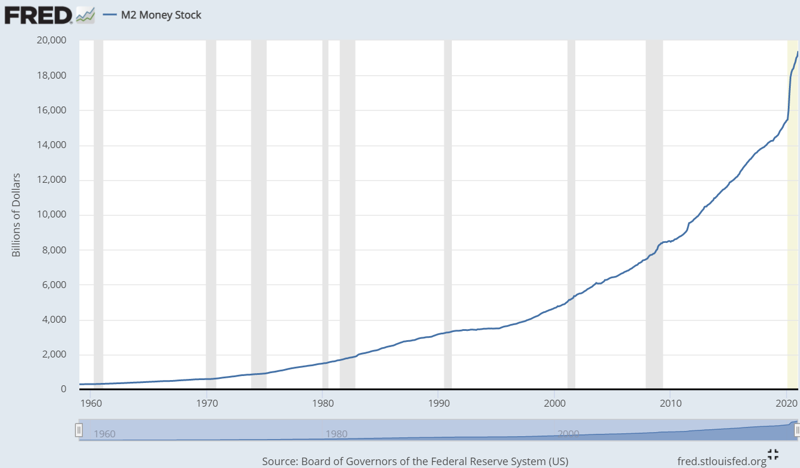

Lyn Alden provides a good explanation of inflation - [November 2020 Newsletter: Defining Inflation](https://www.lynalden.com/november-2020-newsletter/).

The CPI is usually kept below 3% per year because because the way that CPI is reported was changed since the early-1980's. Instead of measuring the cost of maintaining a constant standard of living, we now measure the cost of maintaining a constant level of satisfaction.

There are several ways that CPI can be suppressed using the "constant level of satisfication" measurement method:
* Reduce your requirements for achieving the same level of satisfaction. For example, previously you might be satisifed with living in a spacious double brick house. Now, you're just as satisified living in a one bedroom apartment, or an old house made of weatherboard. In future, you might be satisified living in a studio apartment made of 3d-printed plastic.
* Improvements in technology and infrastructure. For example, replacing naturally grown meat with mass-produced 3d printed meat. This is why most electronic devices reduce in price, or maintains the same price.

However, while you can suppress CPI, it's difficult to suppress asset prices. Improvements in technology and infrastructure, such as faster Internet speeds, better transport, better manufacturing processes, all get capitalised into the price of land, businesses and other assets. The CPI would begin increasing when people's minimum levels of satisfaction cannot be reduced any further, or technogical improvements cannot keep pace with the money supply growth.

[Shadow Government Statistics](http://www.shadowstats.com/) provides statistics using pre-1980 methodology, which shows that the pre-1980 CPI is double than of the official CPI. For a detailed primary on measuring CPI, see [No. 515—PUBLIC COMMENT ON INFLATION MEASUREMENT AND THE CHAINED-CPI (C-CPI)](http://www.shadowstats.com/article/no-438-public-comment-on-inflation-measurement).

All currencies began as warehouse receipts for the same type of thing—namely, monetary metal (usually gold). Today, national currencies are not redeemable for gold, and are instead liquid equity units in a pyramid scheme called fiat currency: a hierarchy of thievery built on top of the freely selected money of the world (gold) which their issuers (central banks) hoard to manipulate its price, insulate their inferior fiat currencies from competitive threats, and perpetually extract wealth from those lower down the pyramid. (credit: [Robert Breedlove](https://breedlove22.medium.com/the-number-zero-and-bitcoin-4c193336db5b)).

From 1945 until 1971, the U.S. dollar was backed by gold as part of the Bretton Woods agreement. On August 1971, the United States terminated convertibility of the US dollar to gold, effectively bringing the Bretton Woods system to an end and rendering the dollar a fiat currency. At the same time, many fixed currencies (such as the pound sterling) also became free-floating. After 1971, it became normal for the cost of living to outpace real wages, wealth and income concentrating to the top 1%, currency devaluations around the world, banking crisis, ballooning debt-to-GDP, government deficits, asset price bubbles, more polarized ideologies, low interest rates and slowdown in technological progress. [WTF Happened In 1971?](https://wtfhappenedin1971.com/) curates some interesting charts to which clearly shows the effect of the Gold Standard pre-1971 versus the Fiat Standard post-1971.

The fiat monetary system is based on Keynesian economics, which is based on [Hitler's Economics](https://mises.org/library/hitlers-economics). What were Hitler's economic policies?
> He suspended the gold standard, embarked on huge public-works programs like autobahns, protected industry from foreign competition, expanded credit, instituted jobs programs, bullied the private sector on prices and production decisions, vastly expanded the military, enforced capital controls, instituted family planning, penalized smoking, brought about national healthcare and unemployment insurance, imposed education standards, and eventually ran huge deficits. The Nazi interventionist program was essential to the regime's rejection of the market economy and its embrace of socialism in one country.

I predict that by 2030:
* The global monetary system will be completely reset, after continued devaluations of fiat currencies around the world.
* The U.S. dollar will either lose its status as a global reserve currency, and/or transform into a different type of currency, such as one backed by gold, commodities, Bitcoin and crypto.
* Bitcoin will be used as a store of value (like gold), and a global settlement network (like FedWire, SWIFT and CHIPS) for most large transactions between untrusted parties. The world will be on a "Bitcoin Standard".
* Most Western democracies will no longer pretend to be a democracy, and will openly embrace socialism. I expect most national governments including the U.S. government will adopt similar social and economic policies that China has already adopted. The people will support socialism because of ongoing stimulus checks and eventually universal basic income.
* Physical cash will be replaced by CBDCs (central bank digital currencies). However, CBDCs will still be inferior to cryptocurrencies, since CBDCs are still fiat currencies but provides even more control to governments over its users.
* Nations will lose control of some states, and some states will lose control of cities. We've already seen cities pushing for crypto-friendly and free-market policies, which is very different to the policies of national governments. It's likely that these cities will declare independence from any government and we start seeing the disintegration of nation states into a decentralised network of cities. The main struggle will be between centralised entities and decentralised networks, rather than between nations. The "threat" to nation states is no longer another nation, but its own citizens who decide to take the crypto lifeboat and become "sovereign individuals".
* Housing will become more affordable, and the stock market will return to more reasonable valuations. This is because Bitcoin will be the best store-of-value to protect against inflation. Historically, investors have pushed up the prices of real estate and other higher yielding assets when interest rates were low. Now, investors can simply store their wealth in Bitcoin, and only invest in real estate and the stock market if those assets are likely to offer a higher return than Bitcoin. In other words, Bitcoin will capture the "monetary premium", the same way that gold captured the monetary premium from "silver", and the silver price dropped to its industrial value.
* Governments will be pressured to reduce taxes to attract people to create value in the nation's economy, since people now have more bargaining power since they can easily transport their wealth across borders.

We will have another 1971-style reset, lead by the World Economic Forum (WEF).

[Welcome To 2030: I Own Nothing, Have No Privacy And Life Has Never Been Better](https://www.forbes.com/sites/worldeconomicforum/2016/11/10/shopping-i-cant-really-remember-what-that-is-or-how-differently-well-live-in-2030)

You have 2 choices:

1. WEF: you'll own nothing and you'll be happy
2. Crypto: no one will own you and you'll define your own happiness

"Nothing is so permanent as a temporary government program." ― Milton Friedman
* personal taxation is a temporary measure to fund the war.
* money printing was a temporary measure to fund the war.
* suspension of the gold standard was temporary to stop gold outflows from the U.S.
* bailouts and stimulus checks were temporary to help the economy recover.
* the USA Patriot Act which granted law enforcement wide-reaching surveillance powers was a temporary measure to fight terrorism.
* the power to declare mandatory lockdowns was a temporary measure to fight COVID.

# The decentralized financial system

[Ash Egan - Crypto Market Map](https://medium.com/@Ashaegan/market-mapping-crypto-f2c138130356), published in 2019 provides a good overview of the crypto ecosystem. It's a bit outdated now since there's been a lot of changes over the past 2 years. However, the key components remain the same.
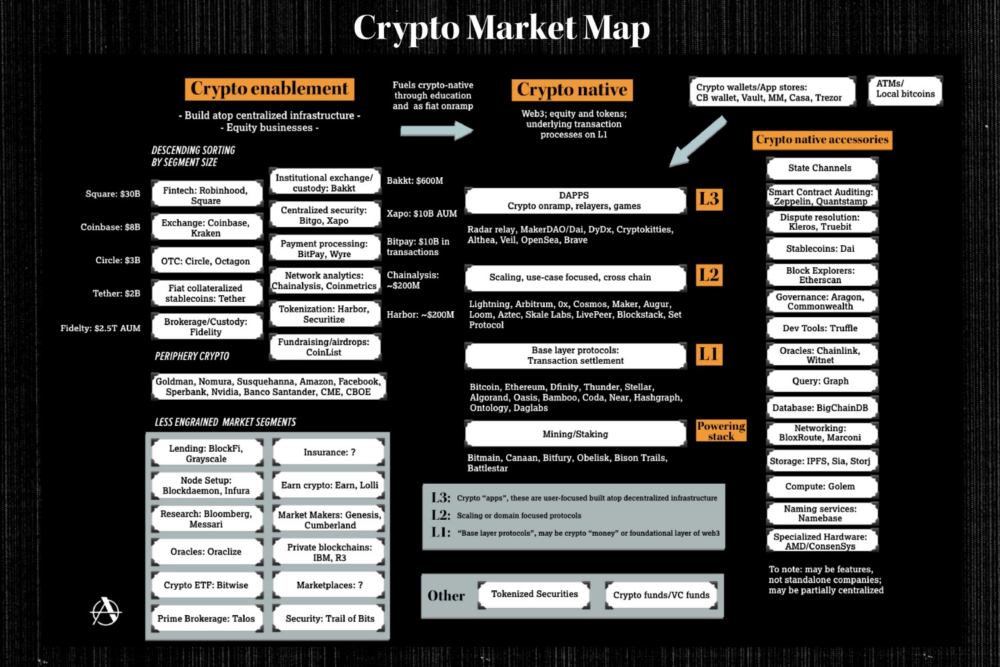

We have "crypto enablement" which consists of centralized and regulated entities (mostly exchanges and crypto banks) that funnel new users from the traditional fiat system. Eventually, those users discover that there is more to converting fiat to crypto and leaving their crypto on the exchange and hoping to sell at a higher price so they can buy a nice car or house. They discover that they can bypass intermediaries and perform all financial activities natively on the protocol, including self-custody, earning passive income, and sending and receiving digital assets peer-to-peer.

# Why does Bitcoin exist?

Bitcoin is digital money that preserves its value across space and time. This contrasts with gold and fiat money. Gold is difficult to transport over space and difficult to verify its authenticity. Fiat loses value over time because central banks have a history of losing their independence and debasing their currency. This makes Bitcoin a superior form of money compared with gold and fiat. The Bitcoin network cannot be corrupted without utilizing more energy than an entire country. Also, the blockchain is publicly visible to everyone across the world, and network participants are immediately alerted to any major discrepancies.

[Satoshi Nakamoto, on 2009-02-11](https://satoshi.nakamotoinstitute.org/posts/p2pfoundation/threads/1/) explains why he developed Bitcoin.

> I've developed a new open source P2P e-cash system called Bitcoin. It's completely decentralized, with no central server or trusted parties, because everything is based on crypto proof instead of trust. Give it a try, or take a look at the screenshots and design paper:
>
> Download Bitcoin v0.1 at http://www.bitcoin.org
>
>The root problem with conventional currency is all the trust that's required to make it work. The central bank must be trusted not to debase the currency, but the history of fiat currencies is full of breaches of that trust. Banks must be trusted to hold our money and transfer it electronically, but they lend it out in waves of credit bubbles with barely a fraction in reserve. We have to trust them with our privacy, trust them not to let identity thieves drain our accounts. Their massive overhead costs make micropayments impossible.
>
>A generation ago, multi-user time-sharing computer systems had a similar problem. Before strong encryption, users had to rely on password protection to secure their files, placing trust in the system administrator to keep their information private. Privacy could always be overridden by the admin based on his judgment call weighing the principle of privacy against other concerns, or at the behest of his superiors. Then strong encryption became available to the masses, and trust was no longer required. Data could be secured in a way that was physically impossible for others to access, no matter for what reason, no matter how good the excuse, no matter what.
>
>It's time we had the same thing for money. With e-currency based on cryptographic proof, without the need to trust a third party middleman, money can be secure and transactions effortless.
>
>One of the fundamental building blocks for such a system is digital signatures. A digital coin contains the public key of its owner. To transfer it, the owner signs the coin together with the public key of the next owner. Anyone can check the signatures to verify the chain of ownership. It works well to secure ownership, but leaves one big problem unsolved: double-spending. Any owner could try to re-spend an already spent coin by signing it again to another owner. The usual solution is for a trusted company with a central database to check for double-spending, but that just gets back to the trust model. In its central position, the company can override the users, and the fees needed to support the company make micropayments impractical.
>
>Bitcoin's solution is to use a peer-to-peer network to check for double-spending. In a nutshell, the network works like a distributed timestamp server, stamping the first transaction to spend a coin. It takes advantage of the nature of information being easy to spread but hard to stifle. For details on how it works, see the design paper at http://www.bitcoin.org/bitcoin.pdf
>
>The result is a distributed system with no single point of failure. Users hold the crypto keys to their own money and transact directly with each other, with the help of the P2P network to check for double-spending.

The Bitcoin supply curve looks like the inverse of the M2 money supply curve. As of March 2021, 18.6 million bitcoins have been mined. The maximum bitcoins that will ever be mined is 21 million. The only way bitcoins are created is through mining new blocks. When a new block is mined, the miner is rewarded with new bitcoins. As of May 2020, each block would reward the miner with 6.25 bitcoins. This reward will be halved to 3.125 bitcoins after the next 210,000 blocks are mined.

It takes on average 10 minutes to mine a single block, which means it takes on average 4 years to mine 210,000 blocks. This means every 4 years, the block reward is halved. In monetary terms, we can say the inflation rate is halved every 4 years.

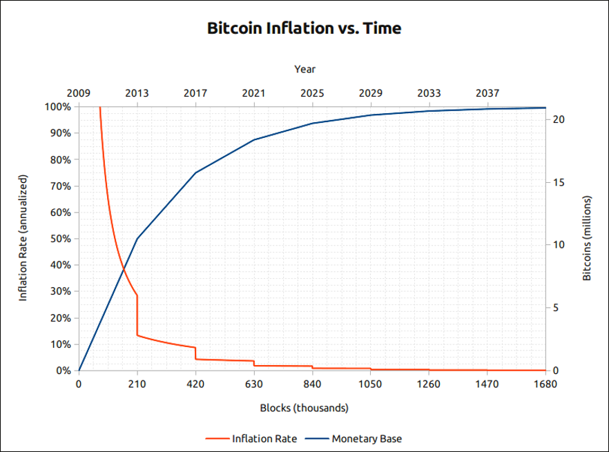

In 2020, the inflation rate of Bitcoin is 1.74%. In 2024, the inflation rate will be 0.82%, and so on, until the last fraction of bitcoin is mined in 2140. A bitcoin can only be divided into 8 decimal places, or 100 million satoshis which are the smallest unit of bitcoin. This is what we mean when we say no more Bitcoin is mined. We've mined all the satoshis.

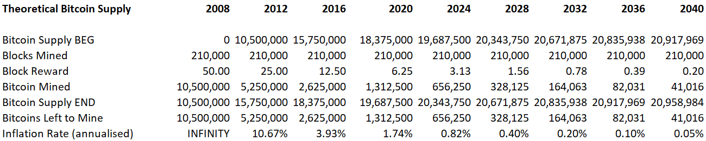

The monetary policy of Bitcoin cannot be changed without the agreement of all network participants. Let's say you want to change the rules in the Bitcoin software, such as removing the block reward halving, or increasing the size of each block. You would need to copy the Bitcoin source code, change it, and run the software. Let's call it Shitcoin. Any transaction that your Shitcoin software validates will be rejected by the rest of the Bitcoin network, because it uses different rules. You would be the only Shitcoin miner, which makes youre Shitcoin network vulnerable to attacks if someone else decides to mine Shitcoins as well and have more computing power than you. Assuming the Shitcoin network did not get attacked, then you need to convince all the Bitcoin investors to sell Bitcoin and buy Shitcoin. You might be partially successful, in that Shitcoin takes 1% market share of Bitcoin. But this method of forking Bitcoin has been attempted many times in the past and has failed. The list of Bitcoin hard forks include Bitcoin Cash, Bitcoin Gold, Bitcoin SV, Bitcoin XT, Bitcoin Classic and Bitcoin Unlimited. All of these forks either disappeared or only took a small fraction of Bitcoin's market share.

The Bitcoin network is a peer to peer network (P2P) or a decentralised network with no central point of failure or command. All the nodes, or computers, that participate in the network are equal – there is no hierarchy – or no topology as the network is flat. This makes the network resilient, if not anti-fragile.

Bitcoin is the antithesis of monetary socialism, where central banks control monetary policy, and often lose their independence and become a political tool for governments. A socialist economy results in large amounts of "misallocations" of capital and resources, which distort asset prices, which makes the economy more fragile.

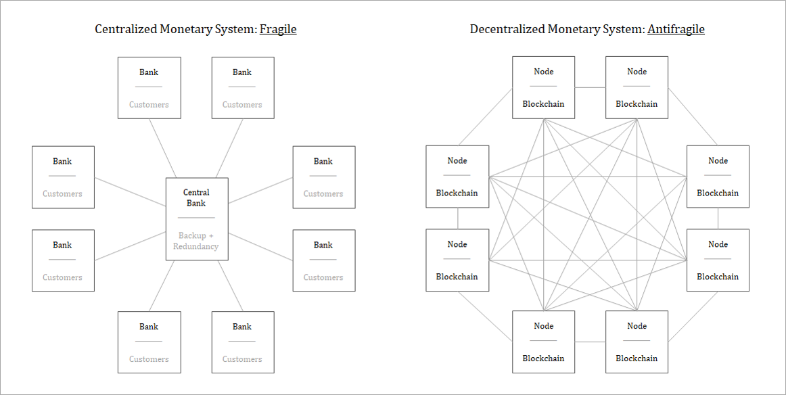

## Bitcoin is a lifeboat

Bitcoin is used as a "lifeboat" by people to escape from the fiat system which is a "sinking ship". This metaphor of a lifeboat is elegantly explained by Andreas Antonopoulos on his YouTube video: [Cryptocurrency Explained: All the ships are sinking (Currency Wars II)](https://youtu.be/stN03wk_Wzs).

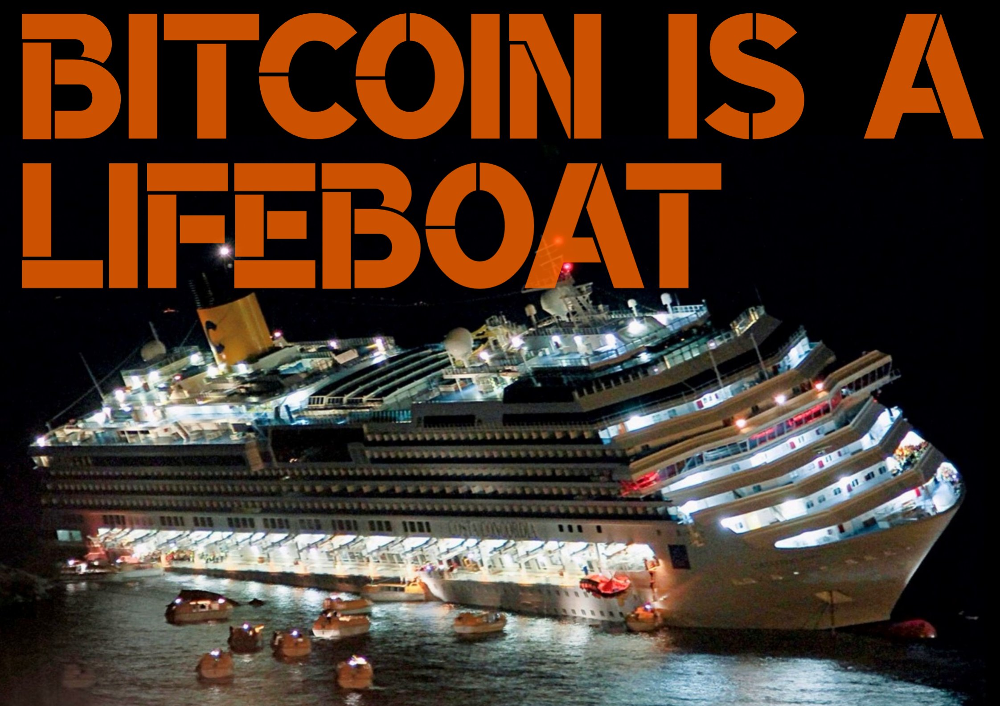

CMS Intern explains it with a video meme using Noah's Ark as the allegory:
[@CMS Intern - The Great USD Flood](https://twitter.com/cmsintern/status/1372256950730170375)

If Bitcoin acts like a lifeboat, then national currencies act like a cruise ship. Think of yourself as being on one of these big cruise ships. You're noticing an increasing number of people congregating around lifeboats and some are even jumping into one and never returning. Then suddenly, the captain central banker announces, "Please return to your cabins! The ship is not sinking. We have everything under control and the 2% angle of the decks is not only normal, but necessary for growth and forward movement.".

However, you notice that sometimes the angle increases even further. You're even hearing the same kind of messages from other ships too because they're all sinking. The captain of the Indian ship is saying "a 25% deck angle is perfectly normal". The captain of the Venezuelan ship is saying "a 98% angle is perfectly normal". The captain says that lifeboats are dangerous, only pirates use lifeboats, lifeboats are unstable and not backed by anything, they have no crew and no captain, etc. The captain wants you to not focus on the sinking ship, and instead focus on how deficient the lifeboats are, and will discourage you from using lifeboats.

The captain also distracts you by pointing to the other fiat currency ships, and says "look, our decks are higher than theirs". 

# How does the Bitcoin blockchain work?

[Bitcoin: A Peer-to-Peer Electronic Cash System](https://nakamotoinstitute.org/bitcoin/) is the whitepaper published by Satoshi Nakamoto in October 2008, which explains how Bitcoin works on a high-level.

First, we should understand what problem that Bitcoin solves.

Imagine that I want to transfer $1,000 to Alice. I send the request to the bank. The bank validates that I have $1,000 in my account and that I have not exceed my daily transfer limit, then creates an entry in the ledger:

| Date       | Sending Account | Receiving Account | Amount |
|------------| --------------- | ----------------- | ------ |
| 2021-03-14 | Bob             | Alice             | $1,000 |

Now, Alice's account has an additional $1,000 which she can withdraw.

What just happened? Both Alice and I trusted the bank to keep records of all the transactions. There was no movement of physical cash to transfer the money. All that was needed was an entry in the ledger. The ledger is owned by the bank, not me or Alice.

And this is the problem. To establish trust between ourselves, we depend on a third party. What if ledger that recorded the $1,000 transfer was corrupted or destroyed? 
* Perhaps there was a natural disaster which destroyed the computers, or a cyber-attack corrupted the ledger. 
* Perhaps you run a business, and Alice claimed she never purchased the product from you (even though she did), and the bank simply refunded the $1,000 to Alice without further investigation.
* Perhaps the government does not like Alice, and confiscated the $1,000 from Alice's account.
* Perhaps the government did not want to increase taxes, and instead asked the bank to double the money supply, and credit the newly created money to the government's account. This means that the $1,000 that you transferred is now only worth $500 at the time of the transfer. The government in effect taxed everyone else who saved in dollars.

For decades, we've trusted banks with custodying and transferring our money. Is there a system where we can transfer money without needing a bank? In other words, is there a way to maintain a ledger among ourselves instead of someone else doing it for us?

The answer is Yes! It's called a distributed ledger. A blockchain is a form of distributed ledger technology (DLT). Bitcoin uses blockchain as its DLT to achieve global consensus on the state of the ledger.

Imagine that we have 10 people who do not trust banks. We all agree to keep records of each others accounts at the same time. And none of us know each other's identity. Everyone starts with an empty folder (which is the blockchain or ledger), a blank page (a block) and has a pen, ready to write down any transactions that occur on the page.

Now, if person #A wants to send $1,000 to person #B, then #A announces to everyone, "I want to transfer $1,000 to #B". Everyone checks whether #A has enough balance to transfer $1,000 to #2. If #A has enough balance, then everyone writes down the transaction on their blank page. The transaction is now considered complete.

As time passes, more people announce their transactions to everyone else. This continues until everyone runs out of space in the current page. Now, the page needs to be "sealed" with a unique key so that it cannot be changed later. In accounting, we call it "closing the books". If everyone trusts the seal, then everyone trusts the contents on the page. In Bitcoin, this is called "proof-of-work" or "mining". The unique key that is generated in the mining process is called a "block hash".

How do you seal a page (i.e. mine a block)? Suppose, you enter the word "apple" into the [SHA-256 hash calculator](https://xorbin.com/tools/sha256-hash-calculator). The calculator outputs "3a7bd3". However, given the output "3a7bd3", it is impossible to know that the input was "apple". But every time you enter "apple" into the calculator, it will always output the same hash, "3a7bd3". In a blockchain, the input is the hash of the previous block, the transactions in the current block, and a nonce. If you modify any of the inputs, the block hash will be completely different. This prevents anyone from changing the history without everyone else knowing. If someone changes the history, then it will be different to everyone else, and the ledger with the different history will be rejected. This makes the Bitcoin ledger "immutable".

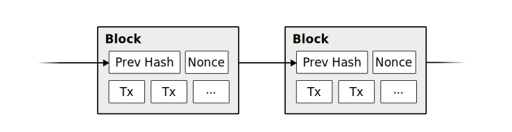

Why would anyone want to mine blocks? The Bitcoin software rewards the first person to mine the block with bitcoins. It also rewards the miner with transaction fees which is paid by the person who announced the transaction.

For example, block 674570 was mined on 14th March, and the miner was rewarded with 6.25 bitcoins as a subsidy, and 0.718 bitcoins in transaction fees. The block reward (subsidy) is halved every 210,000 blocks (or every 4 years), until the maximum of 21 million bitcoins are mined. Eventually, the block subsidy will become zero, but miners will always receive transaction fees for mining a block.

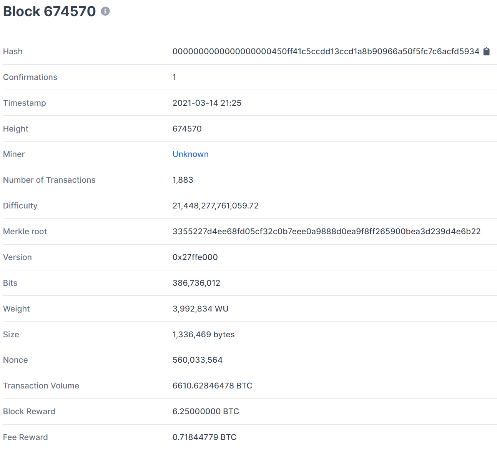
[source: blockchain.com](https://www.blockchain.com/btc/block/674570)

What happens when more people mine Bitcoin, and buy more powerful computers? Does that mean more Bitcoins will be mined at a faster rate? No. The Bitcoin software ensures that every 2016 blocks (or 2 weeks), the average time to mine a block is 10 minutes. The purpose of the Bitcoin network is to record time, not energy consumed. If it takes less than 10 minutes to mine blocks, then the network will make it more difficult to mine blocks. This is called "difficulty retargeting". If the time to produce 2016 blocks is less than 20160 minutes, the difficulty is increased, otherwise, it stays the same or is decreased.

[Bitcoinity](https://data.bitcoinity.org/) shows the average time to mine a block in real time.
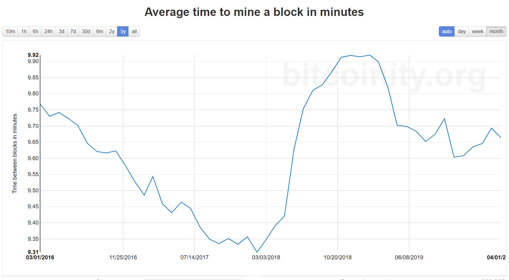

It also shows that mining difficulty is increasing, which correlates closely with the Bitcoin price.
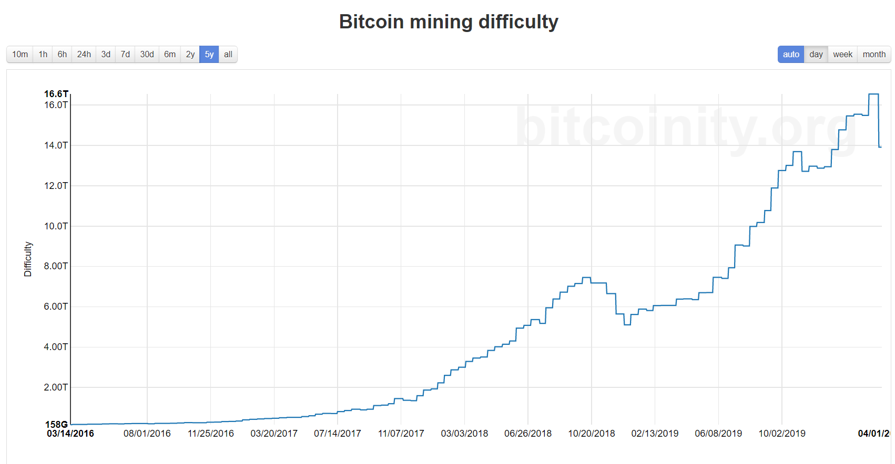

How does difficulty retargeting work? It works by requiring a nonce as one of the inputs to generate a block hash. A nonce is any number that is added to the inputs, such that the calculator outputs a hash that starts with a required number leading zeros. The more leading zeros required in the hash, the more difficult it is to find a nonce that outputs the valid hash.

In block 674570, the difficulty was 21.4 trillion, and a nonce of 560,033,564 was added to the inputs to generate a valid block hash with 20 leading zeros.

# Common misconceptions about Bitcoin

It's important to understand the common misconceptions about Bitcoin, as these are what drives a lot of the FUD (fear, uncertainty and doubt) in mainstream media, which causes uninformed investors to sell their Bitcoin at a steep discount, and avoid Bitcoin until the end of the bull run when those investors are optimistic again and end up buying at a too high price. Following mainstream media is the quickest way to lose money.

All of the misconceptions have been debunked many times already. See:
* [7 Misconceptions About Bitcoin - Lyn Alden](https://www.lynalden.com/misconceptions-about-bitcoin/).
* [Bitcoin Mythology - Square Crypto](https://bitcoinmythology.org/)

## Bitcoin uses too much energy

[Bitcoin uses more electricity than Argentina - 9News](https://www.9news.com.au/technology/bitcoin-uses-more-electricity-than-argentina-norway-study-finds/eb51703b-db82-4fd3-ab2a-c79b96523455) (FUD article)

What the FUD articles assume is that there is zero value in securing a monetary network, and therefore any electricity used for the purpose is wasteful. It also ignores that the majority of Bitcoin mining is being powered by renewal energy or excess energy, and is moving towards that direction.

[Why Bitcoin's energy use is not environmentally harmful, Tomer Strolight](https://tomerstrolight.medium.com/why-bitcoins-energy-use-is-not-environmentally-harmful-6fbba54911ed)
> Not All Energy Use is Harmful to the Environment.
> The part of Bitcoin that uses electricity, mining, is an intensely competitive business and by necessity uses the cheapest sources of energy available. A quick Internet search will reveal that the cheapest sources of electricity come from clean energy.
> Given the incentive to use the cheapest energy, Bitcoin mining migrates towards clean energy, since clean energy is the cheapest source of electricity.

> Bitcoin is a Very Good Use of Energy. Because Bitcoin increases in value over time it incentivizes more saving and reduced spending. Bitcoin stands to correct unnecessary consumption, which includes significant energy misuse and waste.

> Bitcoin Incentivizes the Development of Abundant, Clean Energy. This is a forward looking point. Bitcoin’s energy use actually incentivizes the invention of cheaper ways of generating energy than we now have.

[The Last Word on Bitcoin’s Energy Consumption, Nic Carter](https://www.coindesk.com/the-last-word-on-bitcoins-energy-consumption) explains why Bitcoin consumes so much energy.
> Part of the reason Bitcoin consumes so much electricity is because China lowered the clearing price of energy by overbuilding hydro capacity due to sloppy central planning. In a non-Bitcoin world, this excess energy would either have been used to smelt aluminum or would simply have been wasted.

[Noahbjectivity on Bitcoin Mining](https://medium.com/@nic__carter/noahbjectivity-on-bitcoin-mining-2052226310cb) - Nic Carter responds to claims by Bloomberg columnist Noah Smith in a March 24 article titled "Bitcoin miners are on a path to self-destruction".

[PoW is Efficient, Dan Held](https://www.danheld.com/blog/2019/1/5/pow-is-efficent) explains that securing economic history is an important public good, and is worth the mining costs. In fact, a side-effect of Bitcoin is that it will encourage a shift towards renewal energy sources that have predictable capacity that is otherwise wasted, like hydro and flared methane.

> Bitcoin’s PoW is the buyer of last resort for all electricity, creating a floor that incentivizes the building of new energy producing plants around disparate energy sources that would have otherwise been left untapped.

> Everything requires energy (first law of thermodynamics). Claiming that one usage of energy is more or less wasteful than another is completely subjective since all users have paid market rate to utilize that electricity.

> Bitcoin’s utilization of the excess electrical capacity consumes magnitudes less electricity than existing fiat systems which not only have power requirements banking infrastructure, but the military and political machina. The energy tradeoff for the utilization of that electricity to secure the financial system backbone is a “net positive” outcome. Below I make a rough comparison to the existing financial, military, and political systems 

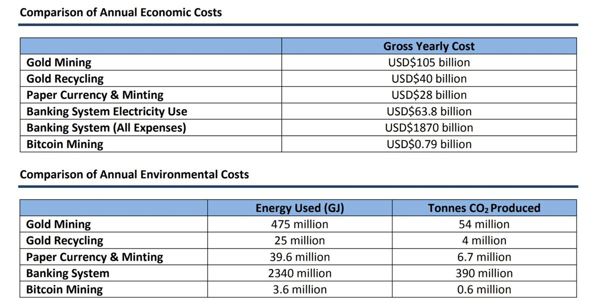

Setee is a company controlled by Norway's 2nd richest man, Kjell Inge Røkke. This is an excerpt from their [shareholder letter](https://www.seetee.io/static/shareholder_letter-6ae7e85717c28831bf1c0eca1d632722.pdf):

> Sec­ond, See­tee will es­tab­lish min­ing op­er­a­tions that trans­fer strand­ed or in­ter­mit­tent elec­tric­i­ty with­out sta­ble de­mand lo­cal­ly—wind, so­lar, hy­dro pow­er— to eco­nom­ic as­sets that can be used any­where. Bit­coin is, in our eyes, a load-bal­anc­ing eco­nom­ic bat­tery, and bat­ter­ies are es­sen­tial to the en­er­gy tran­si­tion re­quired to reach the tar­gets of the Paris Agreement. Our am­bi­tion is to be a valu­able part­ner in new re­new­able projects.

[The Hidden Costs of the Petrodollar, Alex Gladstein](https://bitcoinmagazine.com/culture/the-hidden-costs-of-the-petrodollar)
> Bitcoin critics often focus on its perceived negative externalities: energy consumption, carbon footprint, lack of centralized control and inability to be regulated. Few critics stop to think comparatively about the negative externalities of the world's current financial system of dollar hegemony.
> Bitcoin is not a fintech company competing with Visa. It is a decentralized asset competing to be the new global reserve currency, aiming to inherit the role gold once had and the role the dollar holds today.

[The Number Zero and Bitcoin, Robert Breedlove](https://breedlove22.medium.com/the-number-zero-and-bitcoin-4c193336db5b)
> Tyrannies are less energy-efficient than free markets because they require tyrants to expend resources enforcing compliance with their imposed rulesets and protecting their turf. Voluntary games (free market capitalism) outcompete involuntary games (centrally planned socialism) as they do not accrue these enforcement and protection costs: hence the reason capitalism (freedom) outcompetes socialism (slavery) in the long run. Bitcoin does not require enforced compliance. Economic actors are incentivized to choose the money that best holds its value across time, is most widely accepted, and most clearly conveys market pricing information. Holding the scarcest money is the most energy-efficient strategy a player can employ.

## Bitcoin has no intrinsic value

The intrinsic value of Bitcoin is a censorship-resistant, self-sovereign way to hold, store and transfer your wealth, without relying on any third party middleman such as banks or nation states. Your wealth is stored in provably scarce units that can only be created with time at a diminishing rate until the maximum supply is reached. It cannot be created out of thin air, from more efficient mining (see "difficulty adjustment") or from new discoveries of deposits (due to 21 million hard cap and network effect).

Bitcoin is a digital commodity, as Satoshi envisioned it:
> As a thought experiment, imagine there was a base metal as scarce as gold but with the following properties:
> * boring grey in colour
> * not a good conductor of electricity
> * not particularly strong, but not ductile or easily malleable either
> * not useful for any practical or ornamental purpose
>
> and one special, magical property:
> * can be transported over a communications channel
>
> If it somehow acquired any value at all for whatever reason, then anyone wanting to transfer wealth over a long distance could buy some, transmit it, and have the recipient sell it.

-Satoshi Nakamoto, August 2010

## The other coins are more affordable

[The next Bitcoin? Investors flock to new cryptocurrency 'ADA' - 9News](https://www.9news.com.au/national/bitcoin-news-investors-hunt-for-next-big-cryptocurrency-as-ada-explodes/5cf444f8-c01f-4059-a9a5-ec673d6a6999)

This is called "unit bias". We often get retail investors avoiding Bitcoin because of the hefty tag because one unit costs $1000, or $10,000, or $100,000 depending on which cycle you refer to. People dislike buying fractions of something and prefer to buy whole numbers of something. When you buy 0.01 Bitcoin, you feel unfulfilled. You feel better having 1 whole Bitcoin. However, the unit price of an asset is irrelevant. Bitcoin can be divided into 100 million units (called satoshis) on the base layer, and can be infinitely divided in other layers. If one bitcoin is $100,000, then one satoshi is $0.001, which is very cheap! It's less than one dollar!

What you should be looking at is the market capitalisation of an asset and how is that going to change in future.

## Bitcoin could dissappear like MySpace

A similar misconception is that "Bitcoin is not scarce. Anyone can create their own cryptocurrency which can potentially replace Bitcoin if the technology is superior."

### Absolute scarcity can only be discovered once

Absolute scarcity can only be discovered once. Just like the Internet can only be discovered once. The Internet is a set of protocols that people around the world agree to use. It is not a product, like MySpace, where it can easily be replaced.

[The Number Zero and Bitcoin - Robert Breedlove](https://breedlove22.medium.com/the-number-zero-and-bitcoin-4c193336db5b)
 explains this clearly.

He comparies the invention of Bitcoin with the invention of Zero. Zero changed our understanding of the universe, and had superior arithmetic utility for merchants and banks in the 13th century.

> As with many profound innovations, zero faced vehement resistance from entrenched power structures that were threatened by its existence. Carrying on lawlessly, Italian merchants continued to use the zero-based numeral system, and even began using it to transmit encrypted messages. Zero was essential to these early encryption systems—which is why the word cipher, which originally meant zero, came to mean “secret code.” The criticality of zero to ancient encryption systems is yet another aspect of its contribution to Bitcoin’s ancestral heritage.

> In modernity, zero has become a celebrated tool in our mathematical arsenal. As the binary numerical system now forms the foundation of modern computer programming, zero was essential to the development of digital tools like the personal computer, the internet, and Bitcoin.

> Like the invention of zero, which led to the discovery of “nothing as something” in mathematics and other domains, Bitcoin is the catalyst of a worldwide paradigmatic phase change (which some have started calling The Great Awakening). What numeral is to number, and zero is to the void for mathematics, Bitcoin is to absolute scarcity for money: each is a symbol that allows mankind to apprehend a latent reality (in the case of money, time).

> Path-dependence entails that the sequence of events matters as much as the events themselves: as a simple example, you get a dramatically different result if you shower and then dry yourself off versus if you dry yourself off first and then shower.

> Imagine if the world tried to standardize to a different size electrical outlet: consumers, manufacturers, and suppliers would all resist this costly change unless there was a gigantic prospective gain.

> Bitcoin was launched into the world as a one of a kind technology: a non-state digital money that is issued on a perfectly fixed, diminishing, and predictable schedule. It was strategically released into the wild (into an online group of cryptographers) at a time when no comparative technology existed. Bitcoin’s organic adoption path and mining network expansion are a non-repeatable sequence of events. As a thought experiment, consider that if a “New Bitcoin” was launched today, it would exhibit weak chain security early on, as its mining network and hash rate would have to start from scratch. Today, in a world that is aware of Bitcoin, this “New Bitcoin” with comparatively weak chain security would inevitably be attacked—whether these were incumbent projects seeking to defend their head start, international banking cartels, or even nation-states.

> Path-dependence protects Bitcoin from disruption, as the organic sequence of events which led to its release and assimilation into the marketplace cannot be replicated. Further, Bitcoin’s money supply is absolutely scarce; a totally unique and one-time discovery for money. Even if “New Bitcoin” was released with an absolutely scarce money supply, its holders would be incentivized to hold the money with the greatest liquidity, network effects, and chain security. This would cause them to dump “New Bitcoin” for the original Bitcoin. More realistically, instead of launching “New Bitcoin,” those seeking to compete with Bitcoin would take a social contract attack-vector by initiating a hard fork. An attempt like this was already made with the “Bitcoin Cash” fork, which tried to increase block sizes to (ostensibly) improve its utility for payments. This chain fork was an abject failure and a real world reinforcement of the importance of Bitcoin’s path-dependent emergence.

### The base layer of the financial system should be stable

Bitcoin is a base layer protocol which requires it to be stable, which serves as a foundation for the upper layers which are more experimental and therefore less stable.

For example, Ethereum is seen as superior technology than Bitcoin because it supports an unlimited number of use cases by allowing anyone to build decentralized applications on the platform. It's also a faster payment method than Bitcoin, and with Ethereum 2.0 it is likely to consume less energy and have better scalability. However, Bitcoin remains as the preferred store-of-value. We're also seeing the growth of Bitcoin tokens on Ethereum, Polkadot, Ren and other protocols. So, even if another cryptocurrency can improve upon Bitcoin's technology, it cannot copy the network effects.

[Bitcoin vs Ethereum - Dan Held](https://danheld.substack.com/p/bitcoin-vs-ethereum)

### Culture of decentralization is an emergent property

"Satoshi left because he didn’t want its influence to affect the protocol development creating a single point of failure. The very idea of “Satoshi Vision” itself is against Satoshi’s vision for Bitcoin" — Frederico Tenga

Ethereum, in contrast, has a leader, Vitalik Buterin, who influences the development and monetary policy of the network. This leaves Ethereum open to a political attack vector as Vitalik is a human, has human flaws, and is potentially corruptible.

The monetary policy of Bitcoin is easily verified by anyone. It has a fixed maximum supply a predetermined issuance schedule and difficulty adjustment. Also, being able to verify all transactions and supply from your home computer ensures that the rules of Bitcoin are being followed at any given moment. This makes Bitcoin nodes highly decentralized.

With Ethereum, the community has embraced accelerating costs of running nodes, which pushes developers and users to be increasingly reliant on trusted 3rd party node operates such as Infura.

You cannot build a decentralised culture with code or with a worshipped leader. The culture needs to emerge by itself. We can say that Bitcoin was actually not invented... it was discovered.

[Bitcoin vs Ethereum - Dan Held](https://danheld.substack.com/p/bitcoin-vs-ethereum)

## Bitcoin is too volatile

The volatility you see right now is upward volatility associated to its fast exponential climb towards global acceptance. This will become clearer to the world once 1 billion people find exposure in this asset. At current growth, it will be before 2025.

## Bitcoin's wealth distribution is too concentrated

[Bitcoin’s Distribution was Fair - Dan Held, 2019-01-06](https://www.danheld.com/blog/2019/1/6/bitcoins-distribution-was-fair)

## Bitcoin does not scale and transaction fees will be too expensive

## Bitcoin might have undiscovered vulnerabilities which can cause catastrophic failure

Bitcoin is 40 years in the making, and has been running live since January 2009 with no downtime.

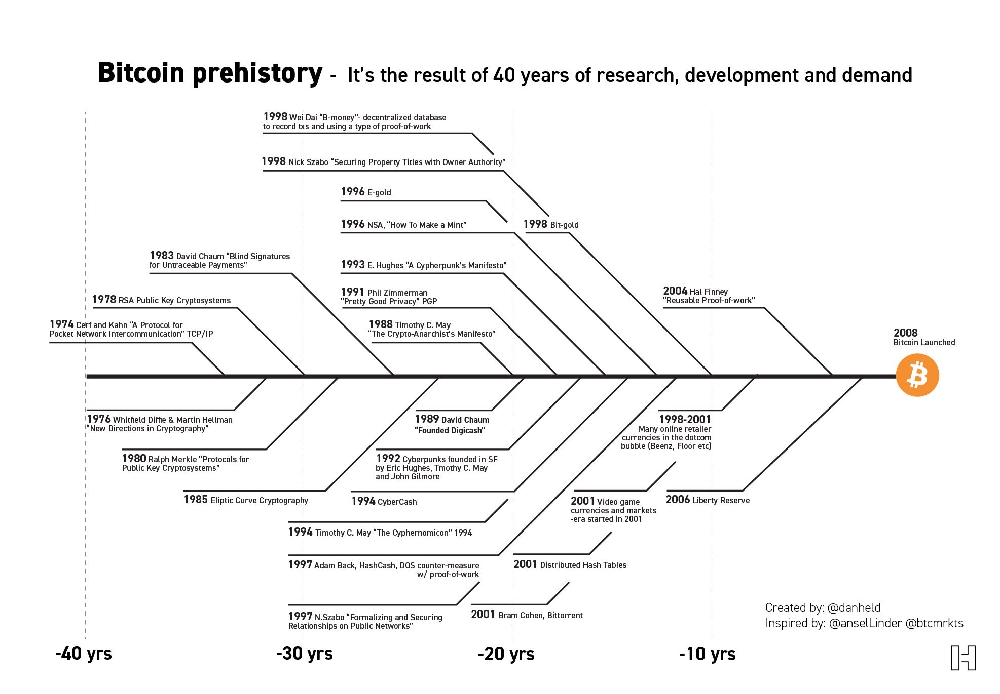

Meanwhile, the Fedwire payment system that allows banks to send money between each other went down for several hours on 24th February 2021.

Also, in January 2021, [Bitcoin Did Not Experience a Double-Spend: The Blockchain Worked as Intended](https://www.cryptoglobe.com/latest/2021/01/bitcoin-did-not-experience-a-double-spend-the-blockchain-worked-as-intended/). However, the news was believable enough that it caused Canadian virtual reality company NexTech AR Solutions to sell 130 bitcoins valued at around $4.2 million (which is $32,308 per bitcoin).

## Bitcoin will be banned

Bitcoin has flourished in countries where it is banned. For example, in Nigeria where use of crypto is banned, people continue to use it, and crypto adoption in the country is at 32% which is the highest in any country in the world. Bitcoin is a decentralized network. There is no entity to shut down, and any effort to shut it down is likely to bring more attention to crypto and reveal more problems about the Nigeria's dire economic situation.

[Why We Can Be Certain Bitcoin Will Never Be Shut Down - OriginCryptoGuy](https://medium.com/original-crypto-guy/why-we-can-be-certain-bitcoin-will-never-be-shut-down-8a37c50c357a)

[Bitcoin is Antifragile - Unchained Capital](https://unchained-capital.com/blog/bitcoin-is-antifragile/)

# Converting Fiat to Bitcoin

Regulated Fiat/Crypto Exchanges
* [Independent Reserve](https://www.independentreserve.com/invite/PQQGEH) - Australian exchange with good SMSF support
* [BTC Markets](https://www.btcmarkets.net/) - Australian exchange with good SMSF support
* [Binance](https://www.binance.com/en/register?ref=BAU03MPK) - the number #1 exchange and evolving into a crypto conglomerate
* [Coinspot](https://www.coinspot.com.au/) - Australian exchange
* [Coinjar](https://www.coinjar.com/) - Australian exchange
* [Swyftx](https://swyftx.com.au/) - Australian broker (note: AUD is converted to USD then converted to crypto)
* [Kraken](https://www.kraken.com/) - US chartered bank
* [Bitfinex](https://www.bitfinex.com/) - US-based exchange and issuer of USD Tether
* [Huobi Australia](https://www.huobi.com.au/) - Australian exchange

P2P non-KYC/AML Fiat/Crypto Exchanges
* [Bisq](https://bisq.network/)
* [Hodl Hodl](https://www.hodlhodl.com/) - this is also a P2P lending platform which uses a 2-3 multi-sig escrow that holds the collateral.

# Crypto-to-Crypto Decentralized Exchanges

* [Uniswap](https://uniswap.org/)
* [SushiSwap](https://www.sushi.com/)
* [Bancor Network](https://app.bancor.network/eth/swap)
* [Curve](https://www.curve.fi/) - exchange designed for stablecoins and bitcoin tokens on Ethereum
* [PancakeSwap](https://pancakeswap.finance/) - yield farm on Binance Smart Chain

To set up Metamask on on Binance Smart Chain, see [Connecting Metamask to Binance Smart Chain](https://academy.binance.com/en/articles/connecting-metamask-to-binance-smart-chain).

# Hardware Wallets

Hardware wallets are the preferred cold storage solution. They store your seed and allow you to verify the transaction that you are signing on a separate device.

[Ledger](https://www.ledger.com/)

[Trezor](https://trezor.io/)

[Coldcard](https://coldcardwallet.com/) - This supports Bitcoin only.

Note - The derivation path for each hardware wallet may be different.

# Software Wallets

These software wallets can also connect to your hardware wallet.

[Metamask](https://metamask.io/) - Ethereum wallet

[MyEtherWallet](https://www.myetherwallet.com/) - Ethereum wallet

[Specter Wallet](https://specter.solutions/) - Bitcoin wallet which can run a full-node

[Electrum](https://electrum.org/) - Bitcoin wallet which connects to the Electrum node.

# Full Bitcoin Node Setups

[RaspiBlitz](https://raspiblitz.org/)

[Umbrel](https://getumbrel.com/)

# Seed Backup Solutions

Please do not store your seed on any device that may connect to the Internet, even if your file is encrypted. If anyone else knows your seed, then they can access all your crypto wallets that were generated from that seed. I recommend backing up your seed offline in a secure medium.

[Billfodl](https://privacypros.io/) - This is a re-usable seed backup solution. The most cost effective product is the [Billfodl Multishard](https://privacypros.io/products/multishard/), which is a bundle of 3 Billfodls.

You can create a "multishard seed", where your seed is split into 3 shards, such that any 2 parts can reconstruct your complete seed. Each shard allows you to store up to 16 words of your seed phrase. Shard One houses words 1 to 16, Shard Two houses words 9 to 24 and Shard 3 houses words 1 to 8 and 17 to 24. Once this process is complete, you will have effectively backed up each seed word twice.

[VIDEO: REVIEWING THE BILLFODL MULTISHARD](https://bitcoinmagazine.com/reviews/video-reviewing-the-billfodl-multishard)

I recommend putting each shard in a separate location. If you are using a 25th word (or passphrase), store the passphrase separately as well.

It's ok to store your hardware wallet PIN in your password manager (such as Bitwarden, 1password or encrypted file). In the worst case that your password manager is compromised, the attacker must have BOTH your PIN and hardware wallet device.

If your hardware wallet is lost or broken, you can restore access to all your crypto accounts by entering your 24-word seed and passphrase into the same brand of hardware wallet or a software wallet. If you want to change to a different brand of hardware wallet (e.g. from Ledger to Trezor), you might find that some crypto assets are not visible. This is because different manufacturers may use different derivation paths. If that is the case, you will need to first enter your seed into a software wallet, then transfer your crypto assets into an address that is visible to your new hardware wallet.

A cheaper solution is to store your seed in tamper-evident bags.
[Coinkite Security Bag Kit](https://store.coinkite.com/store/sec-bag-kit)

# Crypto Custody Solutions

[What are cryptocurrency custody solutions - Investopedia](https://www.investopedia.com/news/what-are-cryptocurrency-custody-solutions/)

If you are a high net worth investor who does not want to deal with the complexities of self-custody, you can use a regulated custodian.

[Coinbase](https://custody.coinbase.com/)

[NYDIG](https://nydig.com/)

[Independent Reserve](https://www.independentreserve.com/products/high-net-worth)

If you want to best of both worlds, you can use a collaborative custody solution where you still hold one of the keys.

[Unchained Capital](https://unchained-capital.com/) - Bitcoin multisig collaborative custody and lending. You can borrow dollars at 2:1 dollar-to-Bitcoin collateralized.

# Bitcoin Lightning Wallets

The [Lightning Network](https://en.wikipedia.org/wiki/Lightning_Network) is a layer on top of Bitcoin that enables faster and smaller P2P transactions. Treat your lightning wallet the same as your cash wallet you take with you on the go. It's expected that most Bitcoin transactions will eventually happen off-chain, and the only transactions on-chain will mainly be large value settlements between insititutions and other high net worth entities.

* [Wallet of Satoshi](https://www.walletofsatoshi.com/) - easiest to use custodial wallet
* [Muun wallet](https://muun.com/) - non-custodial wallet
* [Blue Wallet](https://bluewallet.io/) - non-custodial wallet

# Lending and Staking

Centralized finance (CeFi) platforms allow people to earn interest with Bitcoin directly, however, the funds are held in custodial fashion, unlike DeFi.

[StakingRewards](https://www.stakingrewards.com/) - passive income opportunities with digital assets.

[DeFi Rate](https://defirate.com/) - interest rates from the top crypto lending protocols and crypto banks.

Centralized platforms:
* [BlockFi](https://www.blockfi.com/)
* [Ledn](https://www.ledn.io/)
* [Celsius Network](https://celsius.network/)
* [Nexo Finance](https://nexo.io/)
* [Binance Earn](https://www.binance.com/en/earn)
* [Bitfinex Lend and Earn](https://www.bitfinex.com/lending-products-start/)

Decentralized platforms:
* [AAVE](https://aave.com/)
* [Compound](https://compound.finance/)
* [dYdX](https://dydx.exchange/)
* [Yearn Finance](https://yearn.finance/)
* [Bancor Network](https://app.bancor.network/)
* [Anchor Protocol](https://app.anchorprotocol.com/)

Insurance:
* [Nexus Mutual](https://app.nexusmutual.io/)

On-chain staking:
* [Stacks 2.0](https://stacks.org/) - Stacks (STX) are used as fuel for smart contract execution, transaction processing, and digital asset registrations on the Stacks 2.0 blockchain. It's used as fuel for blockchain transactions and enables holders to earn Bitcoin with Stacking. Stacks enables new use cases like Bitcoin NFTs and stablecoins that settle on Bitcoin.
* [Ethereum 2.0](https://ethereum.org/en/eth2/staking/) - You can earn rewards by running a eth2 validator node. You will need to lock up 32 ETH, and you cannot withdraw both your deposit and rewards until Phase 1.5 (which can take 1-2 years or longer). Alternatively, you can deposit into a staking pool, custodian or convert to a staking token such as [Binance ETH 2.0 (BETH)](https://www.binance.com/en/eth2). See [Ethereum 2.0 Staking Guide](https://www.stakingrewards.com/journal/ultimate-ethereum-2-0-staking-guide).

# Altcoin Investing

## Portfolio Allocation

This is my portfolio allocation. I hold the majority in Bitcoin. I would only hold other coins if they are likely to outperform Bitcoin. If I don't have a percentage for a coin, it might still comprise over 10% of my portfolio, but only for a couple of months.

* Bitcoin (BTC) = 70% to 100% - hardest store of value and dominant monetary network.
* Ethereum (ETH) <= 30% - smart contracts with highest developer mindshare and strong ecosystem
* Enjin (ENJ) <= 10% - online gaming and NFTs
* 0x (ZRX) <= 5% - DeFi infrastructure for P2P exchange
* Secret (SCRT) <= 5% - privacy-preserving smart contracts
* Storj (STORJ) <= 5% - cloud storage
* Decentraland (MANA) <= 5% - online gaming and NFTs
* Power Ledger (POWR) <= 2% - energy trading - xGrid and µGrid
* Chainlink (LINK) <= 1% - data feeds
* Cosmos (ATOM) <= 1% - data feeds
* Origin Protocol (OGN) <= 1% - e-commerce and NFTs
* Basic Attention Token (BAT) <= 1% - online advertising - rewarding attention of users - part of the Brave Browser.
* Stacks (STX) - DeFi on Bitcoin
* Band Protocol (BAND) - DeFi
* Bancor (BNT) - DeFi
* yearn.finance (YFI) - DeFi
* Aave (AAVE) - DeFi
* Frax Finance (FXS) - DeFi
* Ren (REN) - DeFi
* Terra (LUNA) - DeFi, stablecoins
* Polygon (MATIC) - DeFi, ETH layer 2
* Hegic (HEGIC) - DeFi
* Uniswap (UNI) - DeFi
* THORchain (RUNE) - DeFi
* Solana (SOL) - smart contracts
* Polkadot (DOT) - smart contracts
* Tezos (XTZ) - smart contracts
* Harmony (ONE) - smart contracts
* Golem (GLM) - computing
* Theta (THETA) - video streaming
* Alpha Finance Lab (ALPHA) - DeFi
* BarnBridge (BOND) - DeFi
* Binance Coin (BNB) - fuel for Binance Smart Chain (BSC), lower fees than ETH for DeFi

I also have a tiny percentage of my portfolio for highly speculative altcoins. I do not recommend allocating any amount that you cannot afford to lose completely. These altcoins do not satisfy the [project evaluation criteria](#Project-Evaluation). Investing in these altcoins are based purely on social sentiment, price action and temporary solutions that will eventually be addressed by other crypto assets. The price growth of these altcoins are also a good indicator of new retail investors entering the market.

You can use [LunarCRUSH](https://lunarcrush.com/) to predict which coins are good short term gambles.

* Cardano (ADA) - competes with ETH, no apps built on it yet
* VeChain (VET) - supply chain solution still in idea-validation phase
* Hedera Hashgraph (HBAR) - competes with ETH and Bitcoin layer 2
* Litecoin (LTC) - spin-off of BTC
* Dogecoin (DOGE) - spin-off of BTC, created as a joke, very little development
* Nano (NANO) - competes with BTC layer 2
* Ripple (XRP) - competes with BTC layer 2, lacks decentralization

# Crypto Derivatives Trading Platforms

[Derebit](https://www.deribit.com/) - options and futures trading for BTC and ETH

[Bybit](https://www.bybit.com/en-US/) - Futures Trading for BTC, ETH, LINK, XTZ, LTC and other cryptos.

# Project Evaluation

When evaluating how much to invest in an altcoin project, you should ask yourself the following questions:

Is the product already working?

How strong is the ecosystem (developers, businesses, and users)?

What is the unique selling proposition (USP), and how is it different from its competitors?

Does the monetary policy reward long-term holders?

Is the governance decentralised and resistant to attacks?

Are on-chain metrics indicating confidence in the project?

# Data Analysis Tools

[CoinMarketCap](https://coinmarketcap.com/) - directory of cryptocurrencies.

[CoinGecko](https://www.coingecko.com/) - directory of cryptocurrencies.

[Messari](https://messari.io/) - insights and analysis

[LunarCRUSH](https://lunarcrush.com/) - social media analytics

[Binance Research](https://research.binance.com/) - insights and analysis

[TradingView](https://www.tradingview.com/) - price charts

[DeFi Prime](https://defiprime.com/) - curated listing of DeFi products

[DeFi Llama](https://defillama.com/) - DeFi dashboard

[DeFi Pulse](https://defipulse.com/) - DeFi dashboard (ETH-only)

[DeFi Market Cap](https://defimarketcap.io/) - directory of DeFi tokens.

[Glassnode](https://glassnode.com/) - on-chain market intelligence

[Bitcoin Treasuries](https://bitcointreasuries.org/) - list of publicly traded companies that are known to hold Bitcoin.

[Blockchain.com](https://www.blockchain.com/explorer) - Bitcoin and Ethereum blockchain explorer.

[Look Into Bitcoin](https://www.lookintobitcoin.com/) - Bitcoin market cycle and on-chain data.

[Bitcoinity](https://data.bitcoinity.org/) - Bitcoin blockchain and market data.

[Digitalik](https://digitalik.net/btc/) - Bitcoin stock to flow model live chart.

[UsefulTulips](https://www.usefultulips.org/) - charts on P2P cryptocurrency usage around the world

# Bitcoin Price Forecast

Bitcoin has a 4 year halving cycle, with 1-2 years of bull market and 2-3 years of bear market. As with any asset class, it is not immune to speculative mania and leverage, which causes the its price to overextend before a steep correction.

The Stock-To-Flow (S2F) ratio provides a fundamental basis in which to value Bitcoin.

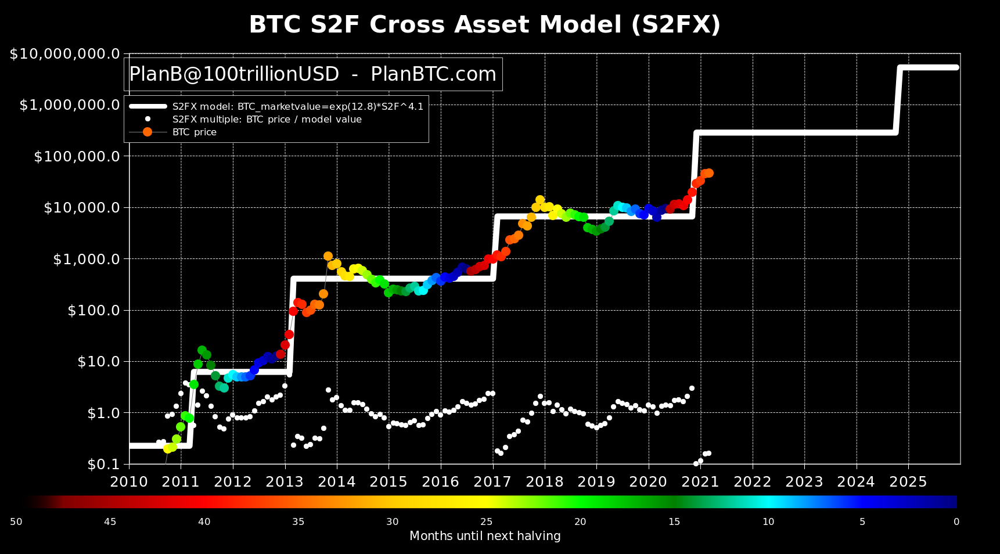
"New orange dot: Feb close $45,240! (Jan was $33,141 and current price is $46,500)" - [@100trillionUSD on 2021-03-01](https://twitter.com/100trillionUSD/status/1366300758036131840).

[Money, Bitcoin and Time: Part 1 of 3](https://breedlove22.medium.com/money-bitcoin-and-time-part-1-of-3-b4f6bb036c04) explains S2F in terms of "hard" and "soft" money.

Hard money is more trustworthy as a store of value precisely because it resists intentional debasements of its value by others and therefore maintains salability across time. The hardness of a monetary good, also known as its soundness, is measured by the stock-to-flow ratio:

* 'Stock' is the existing supply of monetary units
* 'Flow' is the newly created supply over a specified time period, usually one year
* Dividing the stock of a monetary good by its flow equals its stock-to-flow ratio
* The higher the stock-to-flow ratio, the greater the hardness (or soundness) of money

Taking the growth range of the previous cycles, we can expect the Bitcoin price to peak in mid-2021 at US$200k-$400k, then crash to $70k-$200k.

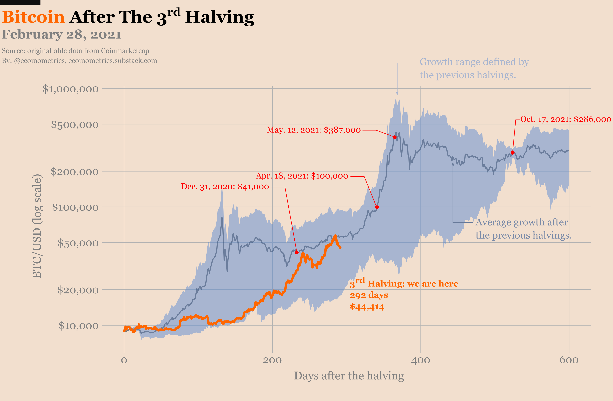

Bitcoin ($1T market value as of March 2021) is going after the "store of value" total addressable market (TAM) which will capture some % of the following:
* Gold ($10T)
* Real Estate ($200T)
* Bonds ($100T)
* Equities ($30T)
* Broad Money ($100T)
* Fine Art/collectibles ($20T)

[Credit: Brandon Quittem](https://twitter.com/Bquittem/status/1365122245895483394?s=20)

This article explains what is likely to happen at the end of the 2021-2022 bull market: [Don't Get Rekt - The anatomy of the next #Bitcoin bear market - Andy Edstrom (Mar 8, 2021)](https://www.btctimes.com/insight/dont-get-rekt)

However, 2021 is the year that Bitcoin reached escape velocity with institutions and HNW investors adding Bitcoin to their portfolios, and hitting $1 trillion market cap. This means we may not see the big 80% corrections in the previous cycles.

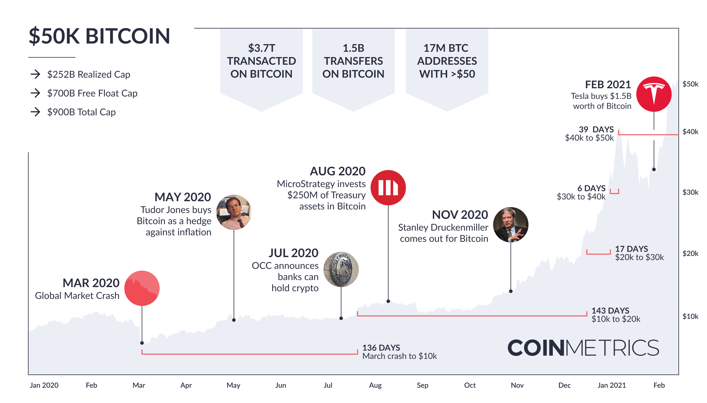

The other outcome (but unlikely until 2027) is we achieve "hyperbitcoinization" in the current cycle. This involves a number of big corporations holding at least 1% of their cash reserves in Bitcoin, traditional infrastructure such as Visa and Mastercard or other provider making it easy for merchants and customers to transact in Bitcoin, and possibly central banks and governments holding and transacting in Bitcoin. This would place the price of one Bitcoin above US$10 million.

[Hyperbitcoinization - The path to becoming the world’s dominant form of money](https://www.bitrawr.com/hyperbitcoinization).

It's good to monitor on-chain metrics such as [Reserve Risk](https://www.lookintobitcoin.com/charts/reserve-risk/) to confirm where we are in the market cycle.
> The last time we had a bull run and Reserve Risk was around this level, BTC was trading around $4k. Seemed crazy at the time. The price went on to push up another 4x when Reserve Risk topped out. If that happened again, we have BTC trading over $200k this year.

-- [@hansthered](https://twitter.com/hansthered), 2021-03-21

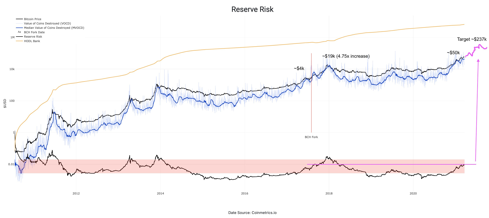

# What price to buy Bitcoin and what amount?

"Linear price charts will fool people (w/out a background), into thinking the price move is emotional. It's not, it's a mathematical supply suffocation provided by the protocol."
[@PrestonPysh](https://twitter.com/PrestonPysh/status/1370077694323490828)

In a linear price chart, each unit in the Y axis is proportional to the dollar value of the asset. However, asset prices do not change in absolute dollars. It changes in percentage returns. Whether a asset's price is $10 or $100 is irrelevant. What matters is the percentage return on investment. When you're investing in an asset, you're looking at the interest rate. When you're investing in a company, you're looking at the dividend yield. Unfortunately, mainstream media often quotes changes in asset prices in dollar value terms. It makes a better headline when "Bitcoin price crashes by $2000" instead of "Bitcoin price crashes by 4%".

In the linear chart below, Bitcoin looks like a bubble about to crash.

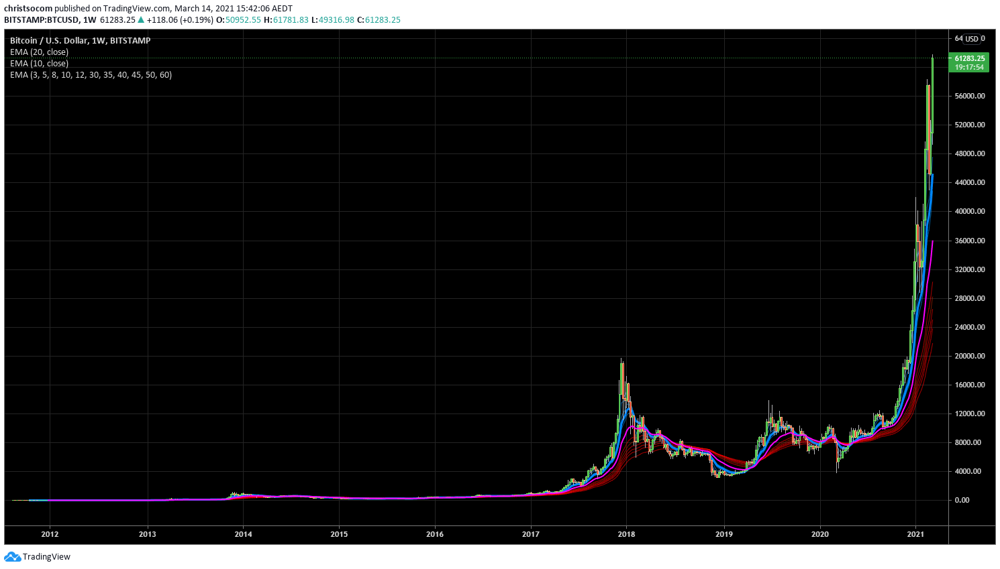

But in a log chart, each unit in the Y axis is proportional to the percentage change in the asset. So, instead of each unit of the axis representing $4,000, it represents a percentage increase from the previous price point. in the chart below, this is a 50-60% increase. In Plan B's S2FX model, each Y-axis unit represents a 900% increase (which is 10x the previous price).

You can see clearly on the log chart that Bitcoin is trending upwards and has 4 year cycles. The price increases about 100x from the bottom to the top, and decreases 80% from the top to the next bottom. This correlates closely with Bitcoin's pre-programmed halving event every 210,000 blocks (which is on average 4 years).

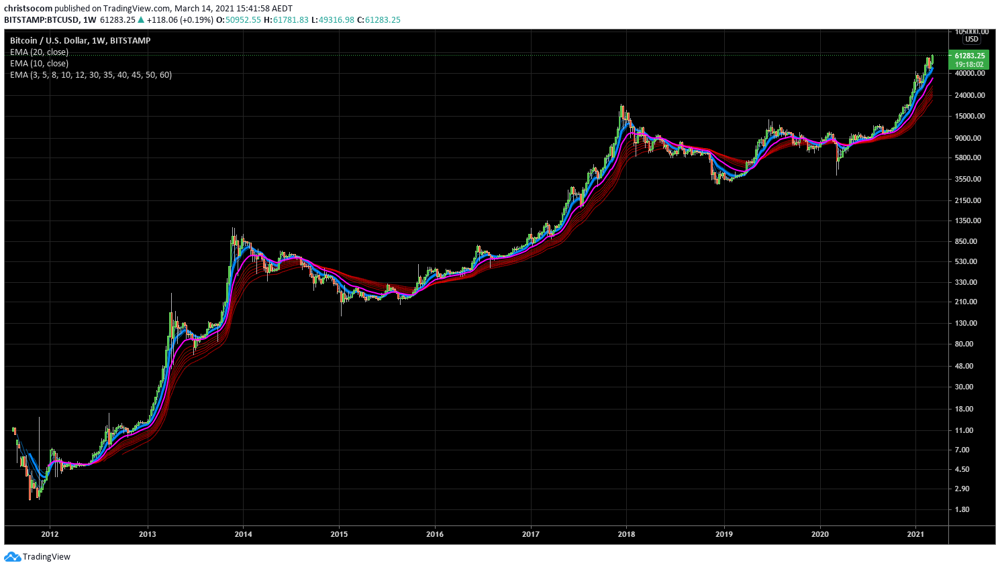

If we are in the 2020-2023 cycle, then the earlier you buy in the cycle, the lower your risk of a drawdown (i.e. the market price of Bitcoin drops below your purchase price). The risk would be highest in the second half of 2021, since you could potentially experience a 80% drawdown.

There are two variables to consider when accumulating Bitcoin.

First, decide how much of your savings that you can afford to hold for at least 2 years, and potentially have a 30% or 80% loss if you sell early (30% if you're early in the cycle, or 80% if you're late in the cycle). This could be 1% of your wealth, 10%, or 50%. It is the percentage that allows you to sleep at night without worrying about the daily price movements. And if the price drops, you would not be worried whether the price will drop further. If it drops further, you will be happy to buy more Bitcoin at a discount. If it does not drop and the price keeps going up, then you're glad that you invested in Bitcoin. This percentage will be different for everyone. But as a minimum, I recommend 1% as an initial investment. Would you pay a one-off 1% as an insurance against your wealth being inflated away at 10-20% per year? It's a no-brainer to have a non-zero position in Bitcoin regardless of your views on it.

Secondly, you can use ["dollar cost averaging"](https://dcabtc.com/) when determining when to buy and the amount of Bitcoin to buy each time. This is because no one can perfectly time the market. This minimises your risk of buying at the market top, since your purchase price will be the average of all the prices you bought Bitcoin over a period of time. In a bull market (e.g. first half of the cycle), you can be more aggressive and buy your initial budget (e.g. 10% of your wealth) within 4 weeks. In a sideways or bear market, there's no rush to buy, so you can buy over 24 months.

Then once you have accumulated your initial budget, you can continue to accumulate more patiently. You can place buy orders when the price is close to the 10 period exponential moving average (EMA) or whenever the price has a 10-30% correction, while maintaining it's upward trend on a longer term time scale. For example, when the price is dipped by 10-30% and now touching the 10 EMA on a daily chart (i.e. 10 day), and is still above 10 EMA on a weekly chart (10 week), it would be a good buy signal. If you want to learn more about price action, you can search for "technical analysis", "trend following", "momentum trading" or "mean reversion trading".

If you have over 50% of your wealth in Bitcoin and crypto near the end of the bull market, it might be worth taking profits (selling) at $200k-$700k, especially if you've bought at a price above $100k. Then buy back at a lower price when the risk of unrealised losses is much lower. This will depend on your financial and tax situation. If you don't need to pay much capital gains tax or you need to the cash, then it might be worth selling 10-50% of your holdings. However, it's difficult to time the exact market top, and there is a risk that you will regret selling too early and buying back at a higher price. Just be aware that your primary goal should be risk minimisation, not profit maximisation.

# Crypto Adoption News

This section contains significant news about crypto adoption.

| Date       | Description | Source |
|------------| --------------- | ----------------- |
| 2019-02-15 | Wyoming becomes first state to give Bitcoin owners full property rights | [Bitcoinist](https://bitcoinist.com/wyoming-bitcoin-full-property-rights/) |
| 2020-05-07 | Paul Tudor Jones buys bitcoin as an inflation hedge, compares crypto to 70s gold trade | [CNBC](https://www.cnbc.com/2020/05/07/paul-tudor-jones-reportedly-buys-bitcoin-as-an-inflation-hedge-compares-crypto-to-70s-gold-trade.html) |
| 2020-07-23 | Banks in US Can Now Offer Crypto Custody Services, Regulator Says | [CoinDesk](https://www.coindesk.com/banks-in-us-can-now-offer-crypto-custody-services-regulator-says) |
| 2020-08-11 | MicroStrategy Adopts Bitcoin as Primary Treasury Reserve Asset and has purchased 21,454 bitcoins at an aggregate purchase price of $250 million. | [BusinessWire](https://www.businesswire.com/news/home/20200811005331/en/) |MicroStrategy-Adopts-Bitcoin-Primary-Treasury-Reserve-Asset)
| 2020-09-15 | On September 14, 2020, MicroStrategy completed its acquisition of 16,796 additional bitcoins at an aggregate purchase price of $175 million. To date, we have purchased a total of 38,250 bitcoins at an aggregate purchase price of $425 million. | [@michael_saylor](https://twitter.com/michael_saylor/status/1305850568531947520) |
| 2020-09-16 | The State of Wyoming has approved Kraken’s application to form the world’s first Special Purpose Depository Institution (SPDI). | [Kraken](https://blog.kraken.com/post/6241/kraken-wyoming-first-digital-asset-bank/) |
| 2020-10-08 | Square buys 4,709 bitcoins worth $50 million | [CNBC](https://www.cnbc.com/2020/10/08/square-buys-50-million-in-bitcoin-says-cryptocurrency-aligns-with-companys-purpose.html) |
| 2020-10-24 | JPMorgan turns bullish on Bitcoin citing 'potential long-term upside' | [CoinTelegraph](https://cointelegraph.com/news/jpmorgan-turns-bullish-on-bitcoin-citing-potential-long-term-upside) |
| 2020-10-29 | Iran's New Crypto Law Requires Miners to Sell Bitcoin Directly to Central Bank to Fund Imports | [Bitcoin.com](https://news.bitcoin.com/iran-crypto-law-miners-bitcoin-central-bank/) |
| 2020-11-17 | A Hedge Fund Billionaire, Stanley Druckenmiller, Just Flipped To Bitcoin—Calling It 'Better' Than Gold | [Forbes](https://www.forbes.com/sites/billybambrough/2020/11/12/a-legendary-hedge-fund-billionaire-just-flipped-to-bitcoin-calling-it-better-than-gold/) |
| 2020-11-30 | Venezuelan Army Starts Mining Bitcoin for 'Unblockable Income' | [Bitcoin.com](https://news.bitcoin.com/venezuela-army-mining-bitcoin-for-unblockable-income/) |
| 2020-12-10 | 169-Year-Old MassMutual Invests $100 Million in Bitcoin via NYDIG | [MassMutual](https://www.massmutual.com/about-us/news-and-press-releases/press-releases/2020/12/institutional-bitcoin-provider-nydig-announces-minority-stake-purchase-by-massmutual) |
| 2020-12-22 | MicroStrategy has purchased an additional 29,646 bitcoins for $650 million at an average price of $21,925 per bitcoin and now hodl an aggregate of 70,470 bitcoins purchased for $1.125 billion at an average price of $15,964 per bitcoin. | [MicroStrategy](https://www.microstrategy.com/en/company/company-videos/microstrategy-announces-over-1b-in-total-bitcoin-purchases-in-2020) |
| 2021-01-05 | US Treasury OCC, the largest US banking regulator, provides guidance allowing US banks to use public blockchains and dollar stablecoins as a settlement infrastructure in the US financial system. | [OCC](https://www.occ.gov/news-issuances/news-releases/2021/nr-occ-2021-2.html) |
| 2021-01-07 | Strike Global launches in the U.S. to enable sending money anywhere, at any time, in seconds, and at no cost, using the Bitcoin network and Lightning network. | [Jack Mallers](https://jimmymow.medium.com/announcing-strike-global-2392b908f611) |
| 2021-01-23 | Pakistan is Now Using Government Funds to Mine Bitcoin | [Decrypt](https://decrypt.co/53918/pakistan-is-now-using-government-funds-to-mine-bitcoin?utm_source=reddit&utm_medium=social&utm_campaign=sm) |
| 2021-01-29 | Ray Dalio Calls Bitcoin ‘One Hell of an Invention,’ Considers It for New Funds | [Bloomberg](https://www.bloomberg.com/news/articles/2021-01-28/bridgewater-s-dalio-calls-bitcoin-one-hell-of-an-invention) |
| 2021-01-08 | MetLife, an investment firm with over $651 billion in assets, expresses interest in investing in Bitcoin | [MetLife](https://investments.metlife.com/content/dam/metlifecom/us/investments/insights/research-topics/macro-strategy/pdf/MIM-GEMS-The-Blockchain-Blockbuster_Yapese-Stones-to-Central-Bank-Digital-Currencies.pdf) |
| 2021-02-02 | Purchase of 14,000 bitcoins worth about $500 million via Coinbase probably belonged to Guggenheim. | [CoinGape](https://coingape.com/did-the-massive-coinbase-outflow-of-14000-bitcoin-belong-to-guggenheim/) |
| 2021-02-06 | The Central Bank of Nigeria has ordered banks across the country to close the accounts of anyone who deals in cryptocurrency | [Decrypt](https://decrypt.co/56762/nigeria-cracks-down-bitcoin-trading-bank-accounts) |
| 2021-02-11 | BNY Mellon is developing the first multi-asset digital custody and administration platform for both traditional and digital assets - bringing bitcoin and cryptocurrencies under the same roof as traditional holdings | [Forbes](https://www.forbes.com/sites/billybambrough/2021/02/11/2-trillion-investment-giant-bny-mellon-reveals-bitcoin-and-crypto-plans-digital-assets-are-the-future)
| 2021-02-12 | Miami Going Full Bitcoin: City Supports Efforts to Hold Bitcoin in Treasury, Allow Tax Payments in BTC | [Bitcoin.com](https://news.bitcoin.com/miami-bitcoin-city-supports-hold-bitcoin-in-treasury-tax-payments-btc/) |
| 2021-02-26 | JPMorgan Says Investors Could Make Bitcoin 1% of Portfolios | [Bloomberg](https://www.bloomberg.com/news/articles/2021-02-25/investors-could-add-up-to-1-of-bitcoin-to-mix-jpmorgan-says) |
| 2021-03-01 | Citibank have released a 106-page report on Bitcoin. BTC's attributes "could spur it to become the currency of choice for international trade... Bitcoin is at a tipping point and we could be at the start of a massive transformation of cryptocurrency into the mainstream." | [CNBC](https://www.cnbc.com/2021/03/01/bitcoin-btc-is-at-a-tipping-point-citi-says.html), [Citibank](https://www.citivelocity.com/citigps/bitcoin/) |
| 2021-03-02 | The most respected economist at Fidelity says bitcoin should be "treated as a form of digital gold." | [Fidelity](https://institutional.fidelity.com/app/literature/item/9901337.html) |
| 2021-02-08 | Tesla bought $1.5B in bitcoin and expects to accept Bitcoin as a form of payment in the near future | [SEC](https://www.sec.gov/Archives/edgar/data/0001318605/000156459021004599/tsla-10k_20201231.htm) |
| 2021-02-11 | Bitcoin has made the Naira almost useless, says Nigerian Senator | [CoinTelegraph](https://cointelegraph.com/news/bitcoin-has-made-the-naira-almost-useless-says-nigerian-senator) |
| 2021-02-23 | Square buys 3,318 bitcoins worth $170 million | [CNBC](https://www.cnbc.com/2021/02/23/square-buys-170-million-worth-of-bitcoin.html) |
| 2021-02-28 | Shark Tank's Kevin O'Leary Reverses Stance on Bitcoin, Says Crypto Is Here to Stay, Invests 3% of His Portfolio | [Bitcoin.com](https://news.bitcoin.com/shark-tanks-kevin-oleary-bitcoin-cryptocurrencies-here-to-stay-invests-portfolio/) |
| 2021-03-04 | Deloitte publishes three part series in the WSJ CFO Journal to review rationale & best practices for incorporating Bitcoin into the corporate treasury. | [WSJ](https://deloitte.wsj.com/cfo/2021/03/02/does-bitcoin-belong-on-your-balance-sheet/) |
| 2021-03-06 | South Korea passed new legislation that will provide a framework for the regulation and legalization of cryptocurrencies and crypto exchanges | [TechCrunch](https://techcrunch.com/2020/03/05/south-korea-passes-one-of-the-worlds-first-comprehensive-cryptocurrency-laws/) |
| 2021-03-11 | Ted Mathas, Chairman and CEO of New York Life, one of the world's largest insurance companies, has joined the board of Bitcoin financial services firm NYDIG. Mathas is also the chairman of the American Council of Life Insurers. | [PR Newswire](https://www.prnewswire.com/news-releases/nydig-announces-appointment-of-new-york-life-chairman-and-ceo-ted-mathas-to-its-board-of-directors-301244301.html) |
| 2021-03-17 | Nigeria: Weekly bitcoin transactions is regularly exceeding 1 billion naira ($2.6 million), which is comparable to the volume seen before the central bank took action. | [Quartz](https://qz.com/africa/1985223/nigerias-crypto-ban-has-startups-and-traders-in-a-frenzy/) |
| 2021-03-24 | Tesla accepts Bitcoin as payment. Tesla is using only internal & open source software & operates Bitcoin nodes directly. Bitcoin paid to Tesla will be retained as Bitcoin, not converted to fiat currency. | [@elonmusk](https://twitter.com/elonmusk/status/1374619379929772034) |
| 2021-03-25 | New Zealand retirement fund KiwiSaver reportedly allocates 5% to Bitcoin in October 2020. | [CoinTelegraph](https://cointelegraph.com/news/new-zealand-retirement-fund-reportedly-allocates-5-to-bitcoin) |
| 2021-03-29 | Visa now settles payments in USDC stablecoin on Ethereum blockchain | [The Block](https://www.theblockcrypto.com/post/99639/visa-now-settles-payments-in-usdc-stablecoin-ethereum) |
| 2021-03-24 | Fidelity files for a bitcoin ETF. This represents the sixth of its kind within the U.S., joining WisdomTree Investments, VanEck Associates Corp., NYDIG Asset Management, First Advisors/SkyBridge and Valkyrie Digital Assets. | [The Block](https://www.theblockcrypto.com/linked/99279/fidelity-bitcoin-etf-filing) |
| 2021-03-25 | Texas chases after Wyoming with crypto law proposal, but challenges remain | [CoinTelegraph](https://cointelegraph.com/news/texas-chases-after-wyoming-with-crypto-law-proposal-but-challenges-remain) |
| 2021-03-25 | Sovereign wealth funds, the investment arms of cash-rich nations, are coming for bitcoin as they look at new strategies to protect their interests after the last 18 months of global economic turmoil. | [Blockworks](https://blockworks.co/sovereign-wealth-funds-are-looking-to-buy-bitcoin/) |
| 2021-03-26 | Microsoft’s ION Digital ID Network Is Live on Bitcoin | [Microsoft](https://techcommunity.microsoft.com/t5/identity-standards-blog/ion-we-have-liftoff/ba-p/1441555), [CoinDesk](https://www.coindesk.com/micorosfts-ion-digital-id-network-live-bitcoin) |
| 2021-03-30 | PayPal launches crypto checkout service which allows consumers to use their crypto holdings to pay at millions of its online merchants around the world | [Reuters](https://www.reuters.com/article/us-crypto-currency-paypal-exclusive-idUSKBN2BM10N) |
| 2021-03-29 | BNY Mellon, the largest custodian bank in the world, compares bitcoin to gold and cites the stock-to-flow ratio in their research report | [Blockworks](https://blockworks.co/bny-mellon-report-takes-on-bitcoin-valuation/) |
| 2021-03-31 | Billionaire Investor George Soros’ Fund Reveals Bitcoin 'Inflection Point' Bet As Crypto Market Cap Nears $2 Trillion | [Forbes](https://www.forbes.com/sites/billybambrough/2021/03/31/billionaire-investor-george-soros-fund-reveals-bitcoin-inflection-point-bet-as-crypto-market-price-nears-2-trillion) |
| 2021-03-31 | Goldman Sachs is close to offering bitcoin and other digital assets to its wealth management clients | [CNBC](https://www.cnbc.com/2021/03/31/bitcoin-goldman-is-close-to-offering-bitcoin-to-its-richest-clients.html) |
| 2021-04-01 | Mark Cuban said that his cryptocurrency portfolio allocation is 60% Bitcoin, 30% Ethereum and 10% the rest. According to Cuban, Bitcoin is "a better alternative to gold... That’s why I own bitcoin and why I never sold it." | [CNBC](https://www.cnbc.com/2021/04/01/mark-cuban-on-his-crypto-portfolio-i-own-ethereum-ether-and-bitcoin.html) |
| 2021-04-02 | The SEC has declared Coinbase's S-1 registration statement effective. Coinbase will go public on April 14th. It was valued at about $90 billion in its final week of trading on Nasdaq’s private market. | [Coinbase](https://blog.coinbase.com/coinbase-announces-effectiveness-of-registration-statement-and-anticipated-listing-date-of-its-1509b281f760) |
| 2021-04-02 | Morgan Stanley Registers Funds With Up to 25% Bitcoin Allocation. | [CryptoBriefing](https://cryptobriefing.com/morgan-stanley-registers-funds-25-bitcoin-allocation/) |
| 2021-04-02 | Paris Hilton reveals that she has invested in Bitcoin for a while and is excited about its future | [CNBC](https://www.cnbc.com/video/2021/04/01/paris-hilton-on-getting-into-the-nft-business-and-her-latest-investments.html) |
| 2021-04-07 | Ukrainian civil servants together own about 46,351 bitcoin. | [CoinDesk](https://www.coindesk.com/crypto-whale-watching-may-become-popular-at-ukrainian-town-council-meetings) |
| 2021-04-08 | Peter Thiel warned that Bitcoin could become a Chinese financial weapon against the U.S. Anthony Pompliano responds by explaining that other countries are competing in bitcoin mining and adoption. He recommends that the U.S. should continue to push innovation and take leadership in decentralised protocols such as Bitcoin. | [CNBC](https://www.cnbc.com/video/2021/04/08/anthony-pompliano-on-peter-thiels-warning-about-chinese-weaponizing-bitcoin.html) |
| 2021-04-09 | SEC Commissioner Hester Peirce says "I don't see how you could ban \[Bitcoin\]. It would be a foolish thing for the government to try. You'd have to shut down the internet. A bigger problem is we'd be missing out on the innovation around Bitcoin" | [Decrypt](https://decrypt.co/65910/government-ban-bitcoin-foolish-sec-hester-peirce) |
| 2021-04-10 |Third Point LLC, a $17B hedge fund, now holds cryptocurrency from five of its funds with Coinbase, and is open to staking and lending cryptos. | [CoinDesk](https://www.coindesk.com/daniel-loeb-third-point-hedge-fund-coinbase-custody-staking) |
| 2021-04-13 | Fmr CIA director @MichaelJMorell tells Forbes Research Director @Steven_Ehrlich that unnecessary focus on #bitcoin and #crypto’s extremely small role in illicit activity is distracting attention from the real challenge, America’s competition with China | [Forbes](https://www.forbes.com/sites/stevenehrlich/2021/04/13/janet-yellen-bitcoin-and-crypto-fearmongers-get-pushback-from-former-cia-director/?sh=5019f0219bb7) |
| 2021-04-15 | MIT Crypto Professor Gary Gensler confirmed as new SEC Chairman | [SEC](https://www.sec.gov/news/press-release/2021-65) |
| 2021-04-18 | Decentralized finance may lead to a paradigm shift in the financial industry and contribute to a more robust, open and transparent financial infrastructure, according to St. Louis Fed | [St Louis Fed](https://research.stlouisfed.org/publications/review/2021/02/05/decentralized-finance-on-blockchain-and-smart-contract-based-financial-markets) |
| 2021-04-19 | In Huge Reversal, China Now Calls Bitcoin "Investment Alternative" After Years Of Crackdowns | [ZeroHedge](https://www.zerohedge.com/markets/huge-reversal-china-now-calls-bitcoin-investment-alternative-after-years-crackdowns) |
| 2021-04-20 | Customers can now buy, hold and sell cryptocurrency directly within the Venmo app | [PR NewsWire](https://www.prnewswire.com/news-releases/introducing-crypto-on-venmo-301272010.html)
| 2021-04-21 | The Mayor of Jackson, Tennessee, @MayorConger, is talking with state legislatures about allowing the city to mine #bitcoin and adding it to their balance sheet. | [@MayorConger](https://twitter.com/MayorConger/status/1384691758936825857) |
| 2021-04-28 | America's Fifth-Largest Banking Institution US Bank to Offer Cryptocurrency Custody | [Bitcoin.com](https://news.bitcoin.com/americas-fifth-largest-banking-institution-us-bank-to-offer-cryptocurrency-custody/) |
| 2021-04-29 | Germany Opens Up to Institutional Crypto Funds effective on July 1 | [Decrypt](https://decrypt.co/69323/damn-huge-germany-opens-up-to-institutional-crypto-funds) |
| 2021-04-29 | Turkey plans to establish a central custodian crypto bank to eliminate counterparty risk | [Bitcoin.com](https://news.bitcoin.com/turkey-crypto-regulation-central-bank-no-intention-to-ban-cryptocurrencies/) |
| 2021-05-06 | ING Bank has released a report analyzing the DeFi space, stating that "DeFi could be more disruptive than Bitcoin to the financial sector" | [ING](https://new.ingwb.com/binaries/content/assets/insights/themes/distributed-ledger-technology/defi_white_paper_v2.0.pdf) |
| 2021-05-07 | John Dalby leaves Bridgewater Associates to join NYDIG as Chief Financial Officer | [PR News Wire](https://www.prnewswire.com/news-releases/nydig-announces-appointment-of-john-dalby-as-chief-financial-officer-301286384.html) |

# Crypto Influencers

The majority of the crypto community discussion happens on Twitter, also known as Crypto Twitter (CT). It was started by Hal Finney [@halfin](https://twitter.com/halfin) when he first began running his Bitcoin node in January 2009.

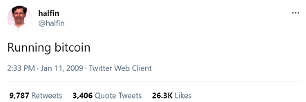

Bitcoin:
* Adam Back, CEO of Blockstream - [@adam3us](https://twitter.com/adam3us)
* Andreas M. Antonopoulos, Bitcoin expert and author - [@aantonop](https://twitter.com/aantonop)
* Vijay Boyapati, Austrian economics researcher - [@real_vijay](https://twitter.com/real_vijay)
* Robert Breedlove, CEO of Parallax Digital - [@Breedlove22](https://twitter.com/Breedlove22)
* Plan B, Bitcoin quant - [@100trillionUSD](https://twitter.com/100trillionUSD)
* Saifedean Ammous, Bitcoin economist - [@saifedean](https://twitter.com/saifedean)
* Stephan Livera, Bitcoin podcaster - [@stephanlivera](https://twitter.com/stephanlivera)
* Jameson Lopp, Casa Co-founder & CTO - [@lopp](https://twitter.com/lopp)
* Jeff Both, technology entrepreneur - [@JeffBooth](https://twitter.com/JeffBooth)
* Dan Held, Head of Growth at Kraken - [@danheld](https://twitter.com/danheld)
* Ecoinometrics, Bitcoin quant - [@ecoinometrics](https://twitter.com/ecoinometrics) - data and insights
* Matt Odell, Bitcoin entrepreneur - [@matt_odell](https://twitter.com/matt_odell)
* Peter McCormack, Bitcoin podcaster - [@PeterMcCormack](https://twitter.com/PeterMcCormack)
* Nic Carter, Founder of CoinMetrics.io - [@nic__carter](https://twitter.com/nic__carter)
* Anthony Pompliano, Growth Lead and Investor - [@APompliano](https://twitter.com/APompliano)
* Preston Pysh, Podcaster - [@PrestonPysh](https://twitter.com/PrestonPysh)
* Cory Klippensten, Founder of Swan Bitcoin - [@coryklippsten](https://twitter.com/coryklippsten)
* Documenting Bitcoin - [@DocumentingBTC](https://twitter.com/DocumentingBTC)
* Bitcoin Archive - [@BTC_Archive](https://twitter.com/BTC_Archive)
* Bitcoin Magazine - [@BitcoinMagazine](https://twitter.com/BitcoinMagazine)
* Max Keiser - [@maxkeiser](https://twitter.com/maxkeiser)
* Alistair Milne - [@alistairmilne](https://twitter.com/alistairmilne)
* Danny Scott, CEO of CoinCorner - [@CoinCornerDanny](https://twitter.com/CoinCornerDanny)
* Ben Kaufman, software developer - [@_benkaufman](https://twitter.com/_benkaufman)

Crypto:
* Kelvin Koh, Partner at The Spartan Group - [@SpartanBlack_1](https://twitter.com/SpartanBlack_1)
* Zhu Su, CEO/CIO at Three Arrows Capital - [@zhusu](https://twitter.com/zhusu)
* [@Phoenix_Ash3s](https://twitter.com/Phoenix_Ash3s)
* Bloqport - [@Bloqbot](https://twitter.com/Bloqbot)
* Glassnode - [@glassnode](https://twitter.com/glassnode)
* Woonomic - [@woonomic](https://twitter.com/woonomic)
* Ki Young Ju - [@ki_young_ju](https://twitter.com/ki_young_ju)
* Chris Burniske - [@cburniske](https://twitter.com/cburniske)

Corporate and HNW Investors:
* Tim Draper - venture capitalist - [@TimDraper](https://twitter.com/TimDraper)
* Stanley Druckenmiller, former Chairman and CEO of Duquesne Family Office
* Michael Saylor, CEO of Microstrategy - [@michael_saylor](https://twitter.com/michael_saylor)
* Tahinis Restaurants - [@TheRealTahinis](https://twitter.com/TheRealTahinis)
* Dan Tapiero, Co-Founder-10T Holdings (2020), DTAP Capital (2004) - [@DTAPCAP](https://twitter.com/DTAPCAP)
* Jack Dorsey, CEO of Twitter - [@jack](https://twitter.com/jack)
* Tyler Winklevoss, Gemini co-founder - [@tyler](https://twitter.com/tyler)
* Cameron Winklevoss, Gemini co-founder - [@cameron](https://twitter.com/cameron)
* Michael Novogratz, CEO of Galaxy Investment Partners - [@novogratz](https://twitter.com/novogratz)
* Chamath Palihapitiya - [@chamath](https://twitter.com/chamath)
* Barry Silbert, Founder and CEO of Digital Currency Group - [@BarrySilbert](https://twitter.com/BarrySilbert)
* Raoul Pal, CEO of RealVision Group - [@RaoulGMI](https://twitter.com/RaoulGMI)
* Ray Dalio - [@RayDalio](https://twitter.com/RayDalio)
* Mark Cuban - [@mcuban](https://twitter.com/mcuban)
* Elon Musk - [@elonmusk](https://twitter.com/elonmusk)

Pro-Bitcoin Political Leaders:
* Francis Suarez, Mayor of Miami - [@FrancisSuarez](https://twitter.com/FrancisSuarez)
* Scott Conger, Mayor of Jackson Tennessee - [@MayorConger](https://twitter.com/MayorConger/status/1384691758936825857)

# Additional Resources

## Investment Advisors

Here are some resources I use for deciding what to invest in when I don't have time for my own research:

* Guy, Coin Bureau - [YouTube](https://www.youtube.com/channel/UCqK_GSMbpiV8spgD3ZGloSw) - crypto investor
* Benjamin Cowen - [YouTube](https://www.youtube.com/channel/UCRvqjQPSeaWn-uEx-w0XOIg) - price action analysis
* Ryan Dinse - [@CryptoDataHound](https://twitter.com/CryptoDataHound) - editor of Crypto Flip Trader at Port Phillip Publishing
* Lark Davis - [@cryptolark](https://twitter.com/cryptolark) - crypto investor
* Kelvin Koh, Partner at The Spartan Group - [@SpartanBlack_1](https://twitter.com/SpartanBlack_1) - crypto investor
* Zhu Su, CEO/CIO at Three Arrows Capital - [@zhusu](https://twitter.com/zhusu) - crypto investor
* Thomas Lee, Fundstrat - [@fundstrat](https://twitter.com/fundstrat) - traditional investor
* Lyn Alden - [@LynAldenContact](https://twitter.com/LynAldenContact) - traditional investor
* George Gammon - [@GeorgeGammon](https://twitter.com/GeorgeGammon) - economic education
* Mark Moss - [@MarkMoss](https://twitter.com/1MarkMoss) - economic education and macro investor

[Top 15 Crypto YouTubers](https://www.coinbureau.com/analysis/crypto-youtube-channels/)

## Bitcoin and Crypto

[Bitcoin.org](https://bitcoin.org/en/) - originally registered and owned by Bitcoin's first two developers. This provides a good beginners guide whether you're an individual, business or a developer.

[Mastering Bitcoin, by Andreas M. Antonopoulos](https://github.com/bitcoinbook/bitcoinbook) - technical book on Bitcoin.

[Mastering Ethereum, by Andreas M. Antonopoulos](https://github.com/ethereumbook/ethereumbook) - technical book on Ethereum.

[Satoshi Nakamoto Institute](https://nakamotoinstitute.org/) - primary source literature with archives of many posts by Bitcoin's early creators.

[Robert Breedlove - Medium](https://breedlove22.medium.com/) - explains the concept of money, Bitcoin and time in a series of essays.

[Bitcoin for Everybody - Saylor Academy](https://learn.saylor.org/course/PRDV151) - free Bitcoin course provided the foundation owned by Michael Saylor, who is the CEO of MicroStrategy.

[Binance Academy](https://academy.binance.com/) - guide on trading and staking on Binance.

[Coin Bureau](https://www.coinbureau.com/) - crypto education

## Economics

[The Bitcoin Standard: The Decentralized Alternative to Central Banking](https://www.amazon.com.au/Bitcoin-Standard-Decentralized-Alternative-Central-ebook/dp/B07BPM3GZQ) - book explaining the evolution of money over millenia and the social implications of Bitcoin.

[The Blocksize War: The battle for control over Bitcoin’s protocol rules](https://www.amazon.com.au/Blocksize-War-control-Bitcoins-protocol-ebook/dp/B08Z18GWD6/
) - written account of one of the most tumultuous periods in Bitcoin's history during 2015-2017.

[The Changing World Order - an online series by Ray Dalio](https://www.principles.com/the-changing-world-order/) - a study on the rises and declines of leading empires.

[The Price of Tomorrow: Why Deflation is the Key to an Abundant Future, Jeff Booth](https://www.amazon.com.au/Price-Tomorrow-Deflation-Abundant-Future/dp/1999257405) - economics book

[Sovereign Individual: Mastering the Transition to the Information Age, James Dale Davidson (1999)](https://www.amazon.com.au/Sovereign-Individual-Mastering-Transition-Inform/dp/0684832720) - economics book

[Layered Money: From Gold and Dollars to Bitcoin and Central Bank Digital Currencies](https://www.amazon.com/Layered-Money-Dollars-Bitcoin-Currencies-ebook/dp/B08PS293NT) - economics book

[The Road to Serfdom, Friedrich A. Hayek](https://mises.org/library/road-serfdom-0) - economics book
