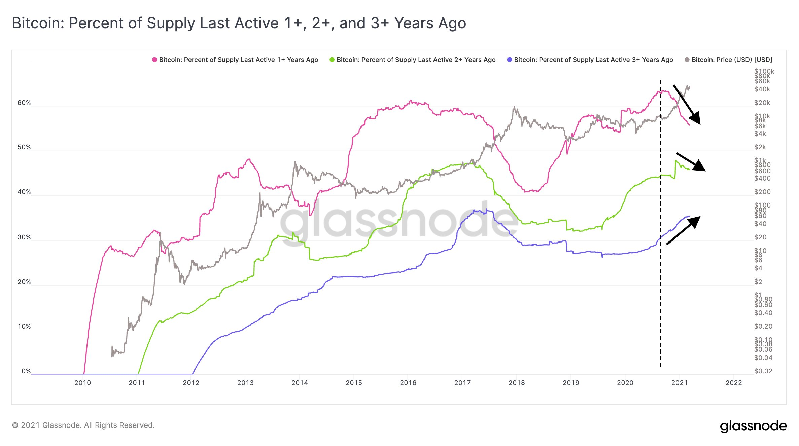

# CRYPTO INVESTING GUIDE

This is a quick reference guide for crypto investors.

# The traditional financial system

Gold Standard prior to 1971

Fiat Standard

CBDCs are not cryptocurrencies.

# The decentralized financial system

[Ash Egan - Crypto Market Map](https://medium.com/@Ashaegan/market-mapping-crypto-f2c138130356)

# Why does Bitcoin exist?

# Common misconceptions about Bitcoin

## Bitcoin uses too much energy

[Bitcoin uses more electricity than Argentina - 9News](https://www.9news.com.au/technology/bitcoin-uses-more-electricity-than-argentina-norway-study-finds/eb51703b-db82-4fd3-ab2a-c79b96523455)

What the FUD articles assume is that there is value in securing a monetary network, and therefore any electricity used for the purpose is wasteful. It also ignores that the majority of Bitcoin mining is being powered by renewal energy or excess energy, and is moving towards that direction.

Setee is a company controlled by Norway's 2nd richest man, Kjell Inge Røkke. This is an excerpt from their [shareholder letter](https://www.seetee.io/static/shareholder_letter-6ae7e85717c28831bf1c0eca1d632722.pdf):

> Sec­ond, See­tee will es­tab­lish min­ing op­er­a­tions that trans­fer strand­ed or in­ter­mit­tent elec­tric­i­ty with­out sta­ble de­mand lo­cal­ly—wind, so­lar, hy­dro pow­er— to eco­nom­ic as­sets that can be used any­where. Bit­coin is, in our eyes, a load-bal­anc­ing eco­nom­ic bat­tery, and bat­ter­ies are es­sen­tial to the en­er­gy tran­si­tion re­quired to reach the tar­gets of the Paris Agreement. Our am­bi­tion is to be a valu­able part­ner in new re­new­able projects.

## The other coins are more affordable

[The next Bitcoin? Investors flock to new cryptocurrency 'ADA' - 9News](https://www.9news.com.au/national/bitcoin-news-investors-hunt-for-next-big-cryptocurrency-as-ada-explodes/5cf444f8-c01f-4059-a9a5-ec673d6a6999)

## Bitcoin could dissappear like MySpace

"Blockchain not Bitcoin".

## Bitcoin will be banned

# Converting Fiat to Bitcoin

Regulated Fiat/Crypto Exchanges
* [Independent Reserve](https://www.independentreserve.com/) - Australian exchange with good SMSF support
* [BTC Markets](https://www.btcmarkets.net/) - Australian exchange with good SMSF support
* [Swyftx](https://swyftx.com.au/) - AUD is converted to USD then converted to crypto
* [Binance](https://www.binance.com/) - the number #1 exchange and evolving into a crypto conglomerate
* [Kraken](https://www.kraken.com/) - US chartered bank
* [Bitfinex](https://www.bitfinex.com/) - US-based exchange and issuer of USD Tether
* [Huobi Australia](https://www.huobi.com.au/)

P2P non-KYC/AML Fiat/Crypto Exchanges
* [Bisq](https://bisq.network/)
* [Hodl Hodl](https://www.hodlhodl.com/)

# Crypto-to-Crypto Decentralized Exchanges

* [Uniswap](https://uniswap.org/)
* [SushiSwap](https://www.sushi.com/)
* [Bancor Network](https://app.bancor.network/eth/swap)

# Hardware Wallets

Hardware wallets are the preferred cold storage solution. They store your seed and allow you to verify the transaction that you are signing on a separate device.

[Ledger](https://www.ledger.com/)

[Trezor](https://trezor.io/)

[Coldcard](https://coldcardwallet.com/) - This supports Bitcoin only.

Note - The derivation path for each hardware wallet may be different.

# Wallet Software

[Metamask](https://metamask.io/) - Ethereum wallet

[Specter Wallet](https://specter.solutions/) - Bitcoin wallet which can run a full-node

[Electrum](https://electrum.org/) - Bitcoin wallet which connects to the Electrum node.

# Seed Backup Solutions

[Billfodl](https://privacypros.io/)

[Seedplate](https://store.coinkite.com/store/seedplate)

You can create a "multishard seed", where your seed is split into 3 shards, such that any 2 parts can reconstruct your complete seed. Each shard allows you to store up to 16 words of your seed phrase, and each unit tells you which 16 out of the 24 total words to load up. Shard One houses words 1 to 16, Shard Two houses words 9 to 24 and Shard 3 houses words 1 to 8 and 17 to 24. Once this process is complete, you will have effectively backed up each seed word twice.

# Crypto Custody Solutions

[What are cryptocurrency custody solutions - Investopedia](https://www.investopedia.com/news/what-are-cryptocurrency-custody-solutions/)

[Coinbase Custody](https://custody.coinbase.com/)

[Independent Reserve High Net Worth](https://www.independentreserve.com/products/high-net-worth)

# Bitcoin Lightning Wallets

The [Lightning Network](https://en.wikipedia.org/wiki/Lightning_Network) is a layer on top of Bitcoin that enables faster and smaller P2P transactions. Treat your lightning wallet the same as your cash wallet you take with you on the go. It's expected that most Bitcoin transactions will eventually happen off-chain, and the only transactions on-chain will mainly be large value settlements between insititutions and other high net worth entities.

* [Wallet of Satoshi](https://www.walletofsatoshi.com/) - easiest to use custodial wallet
* [Muun wallet](https://muun.com/) - non-custodial wallet
* [Blue Wallet](https://bluewallet.io/) - non-custodial wallet

# Lending and Staking

Centralized finance (CeFi) platforms allow people to earn interest with Bitcoin directly, however, the funds are held in custodial fashion, unlike DeFi.

[StakingRewards](https://www.stakingrewards.com/) - passive income opportunities with digital assets.

[DeFi Rate](https://defirate.com/) - interest rates from the top crypto lending protocols and crypto banks.

Centralized platforms:
* [BlockFi](https://www.blockfi.com/)
* [Celsius Network](https://celsius.network/)
* [Nexo Finance](https://nexo.io/)
* [Binance Earn](https://www.binance.com/en/earn)
* [Bitfinex Lend and Earn](https://www.bitfinex.com/lending-products-start/)

Decentralized platforms:
* [AAVE](https://aave.com/)
* [Compound](https://compound.finance/)
* [dYdX](https://dydx.exchange/)

On-chain staking:
* [Stacks 2.0](https://stacks.org/) - Stacks (STX) are used as fuel for smart contract execution, transaction processing, and digital asset registrations on the Stacks 2.0 blockchain. It's used as fuel for blockchain transactions and enables holders to earn Bitcoin with Stacking. Stacks enables new use cases like Bitcoin NFTs and stablecoins that settle on Bitcoin.
* [Ethereum 2.0](https://ethereum.org/en/eth2/staking/) - You can earn rewards by running a eth2 validator node. You will need to lock up 32 ETH, and you cannot withdraw both your deposit and rewards until Phase 1.5 (which can take 1-2 years or longer). Alternatively, you can deposit into a staking pool, custodian or convert to a staking token such as [Binance ETH 2.0 (BETH)](https://www.binance.com/en/eth2). See [Ethereum 2.0 Staking Guide](https://www.stakingrewards.com/journal/ultimate-ethereum-2-0-staking-guide).

# Altcoin Trading

## Portfolio Allocation

This is my portfolio allocation. I hold the majority in Bitcoin. I would only buy other coins if they are likely to outperform Bitcoin.

* Bitcoin (BTC) = 70% to 100%
* Ethereum (ETH) <= 30%
* Enjin (ENJ) <= 10%
* 0x (ZRX) <= 5%
* Secret (SCRT) <= 5%
* Storj (STORJ) <= 5%
* POWR <= 2%
* LINK <= 2%
* DOT <= 2%
* MANA <= 1%
* Band Protocol (BAND)
* Bancor (BNT)
* yearn.finance (YFI)
* Ren (REN)
* Hegic (HEGIC)
* Uniswap (UNI)
* Polkadot (DOT)
* Binance Coin (BNB) - fuel for Binance Smart Chain (BSC)

I occassionally trade a small amount of "questionable" coins, which Bitcoin maxis commonly refer to as "shitcoins". I do not recommend holding these coins for longer than a month or holding any amount that you cannot afford to lose completely. The price is driven mostly by speculation and marketing rather than any working decentralized product. However, sometimes technological progress follows after speculation, so it's still worth keeping an eye on shitcoins. Also, the growth of shitcoins are a good indicator of new retail investors entering the market.

* Dogecoin (DOGE)
* Litecoin (LTC)
* Cardano (ADA)
* Hedera Hashgraph (HBAR)
* Nano (NANO)
* Ripple (XRP)

# Project Evaluation

Is the product already working?

How strong is the ecosystem (developers, businesses, and users)?

What is the unique selling proposition (USP), and how is it different from its competitors?

Does the monetary policy reward long-term holders?

Is the governance decentralised and resistant to attacks?

Are on-chain metrics indicating confidence in the project?

# Data Analysis Tools

[CoinMarketCap](https://coinmarketcap.com/) - directory of cryptocurrencies.

[TradingView](https://www.tradingview.com/) - price charts

[DeFi Pulse](https://defipulse.com/) - directory of DeFi protocols.

[Glassnode](https://glassnode.com/) - on-chain market intelligence

[Bitcoin Treasuries](https://bitcointreasuries.org/) - list of publicly traded companies that are known to hold Bitcoin.

# Price Forecast

Bitcoin has a 4 year halving cycle, with 2 years of bull market and 2 years of bear market. As with any asset class, it is not immune to speculative mania and leverage, which causes the its price to overextend before a steep correction.

"New orange dot: Feb close $45,240! (Jan was $33,141 and current price is $46,500)" - [@100trillionUSD on 2021-03-01](https://twitter.com/100trillionUSD/status/1366300758036131840).

1+ year hodlers: selling. 2+ year hodlers: selling. 3+ year hodlers aka "been in a bull market before and know how this works": stacking sats.

[Don't Get Rekt - The anatomy of the next #Bitcoin bear market - Andy Edstrom (Mar 8, 2021)](https://www.btctimes.com/insight/dont-get-rekt)

# Crypto Twitter

Bitcoin:
* [@aantonop](https://twitter.com/aantonop)
* [@real_vijay](https://twitter.com/real_vijay)
* [@Breedlove22](https://twitter.com/Breedlove22)
* [@100trillionUSD](https://twitter.com/100trillionUSD)
* [@saifedean](https://twitter.com/saifedean)
* [@JeffBooth](https://twitter.com/JeffBooth)
* [@danheld](https://twitter.com/danheld)
* [@matt_odell](https://twitter.com/matt_odell)
* [@adam3us](https://twitter.com/adam3us)
* [@PeterMcCormack](https://twitter.com/PeterMcCormack)
* [@nic__carter](https://twitter.com/nic__carter)
* [@APompliano](https://twitter.com/APompliano)
* [@DocumentingBTC](https://twitter.com/DocumentingBTC)
* [@BTC_Archive](https://twitter.com/BTC_Archive)
* [@PrestonPysh](https://twitter.com/PrestonPysh)
* [@BitcoinMagazine](https://twitter.com/BitcoinMagazine)
* [@maxkeiser](https://twitter.com/maxkeiser)
* [@coryklippsten](https://twitter.com/coryklippsten)
* [@alistairmilne](https://twitter.com/alistairmilne)
* [@CoinCornerDanny](https://twitter.com/CoinCornerDanny)
* [@_benkaufman](https://twitter.com/_benkaufman)

Crypto:
* [@SpartanBlack_1](https://twitter.com/SpartanBlack_1)
* [@zhusu](https://twitter.com/zhusu)
* [@Bloqbot](https://twitter.com/Bloqbot)
* [@glassnode](https://twitter.com/glassnode)
* [@woonomic](https://twitter.com/woonomic)
* [@ki_young_ju](https://twitter.com/ki_young_ju)

Corporate and HNW Investors:
* [@TimDraper](https://twitter.com/TimDraper)
* [@michael_saylor](https://twitter.com/michael_saylor)
* [@novogratz](https://twitter.com/novogratz)
* [@BarrySilbert](https://twitter.com/BarrySilbert)
* [@tyler](https://twitter.com/tyler)
* [@cameron](https://twitter.com/cameron)
* [@elonmusk](https://twitter.com/elonmusk)

Investing:
* [@LynAldenContact](https://twitter.com/LynAldenContact)
* [@GeorgeGammon](https://twitter.com/GeorgeGammon)
* [@MarkMoss](https://twitter.com/1MarkMoss)

# Additional Resources

[Binance Academy](https://academy.binance.com/)